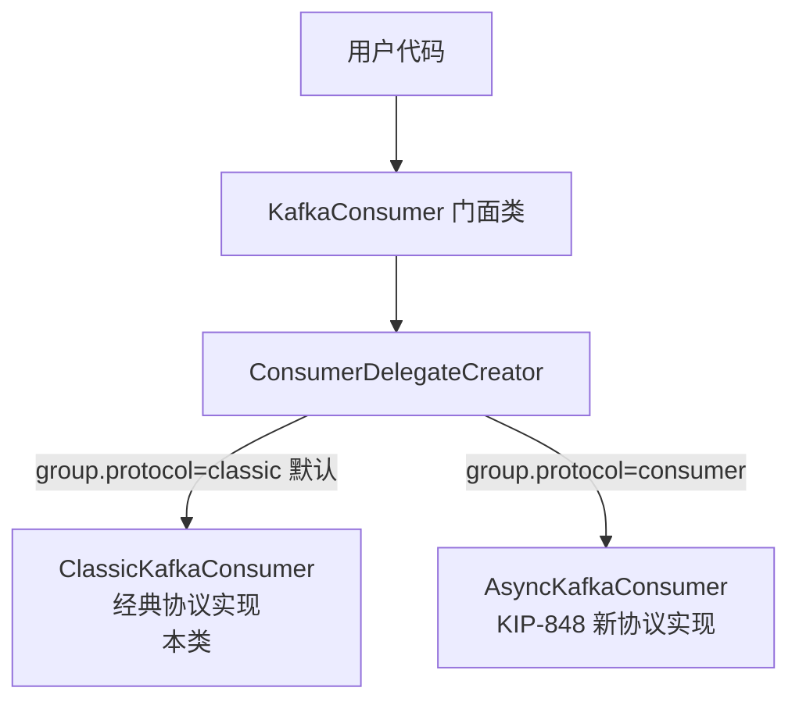
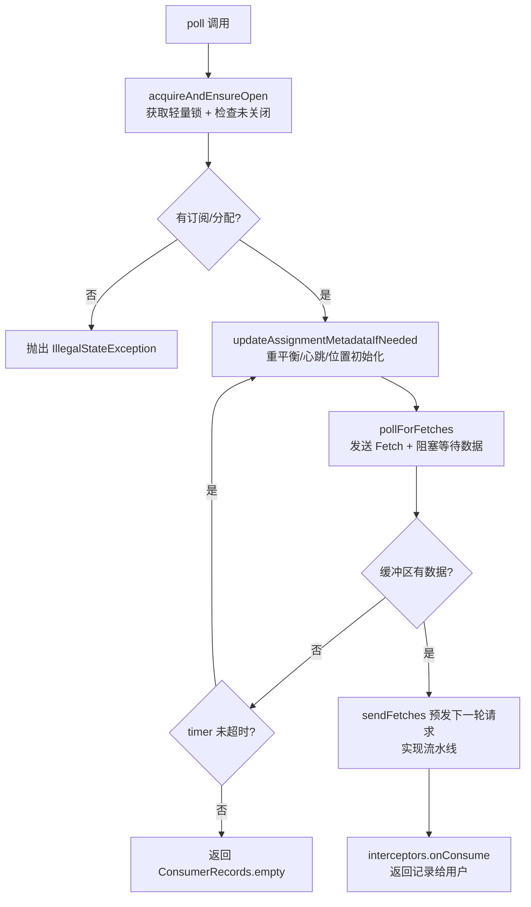
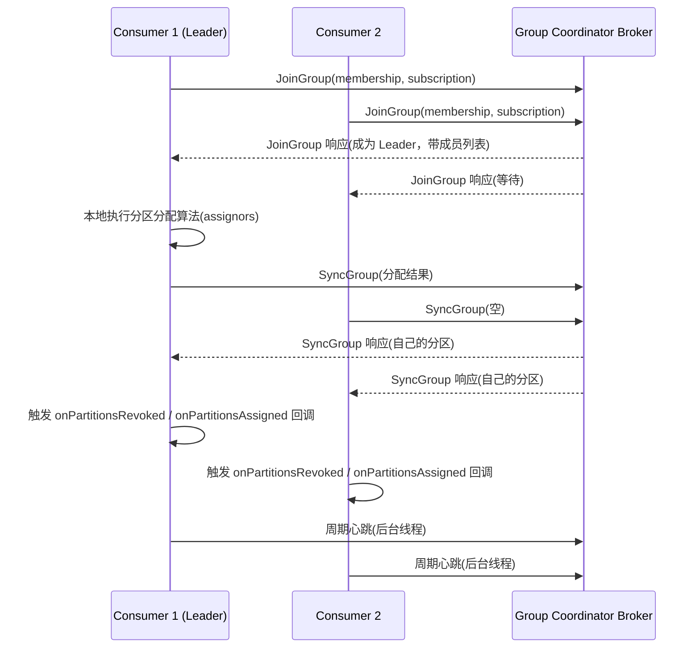

# `ClassicKafkaConsumer` 源码深度分析

> 文件位置：`clients/src/main/java/org/apache/kafka/clients/consumer/internals/ClassicKafkaConsumer.java`
>
> 源码版本：Apache Kafka（当前工作区）

---

## 目录

- [一、类的定位与作用](#一类的定位与作用)
- [二、底层运行原理](#二底层运行原理)
- [三、关键设计要点总结](#三关键设计要点总结)

---

## 一、类的定位与作用

`ClassicKafkaConsumer<K, V>` 是 `ConsumerDelegate<K, V>` 接口的一个实现，**是 Kafka Java 消费者（`KafkaConsumer`）的核心实现之一**，实现了经典的消费者组协议（pre-KIP 848）。

### 1.1 在整个架构中的位置

自 **KIP-848**（新消费者组协议）引入后，`KafkaConsumer` 被重构为**外观（Facade）模式**：用户直接使用 `KafkaConsumer`，但它本身几乎不做任何事，只是把调用转发给内部的一个 `ConsumerDelegate`：



`ConsumerDelegateCreator.create()` 中的选择逻辑：

```java
GroupProtocol groupProtocol = GroupProtocol.valueOf(
        config.getString(ConsumerConfig.GROUP_PROTOCOL_CONFIG).toUpperCase(Locale.ROOT));
if (groupProtocol == GroupProtocol.CONSUMER) {
    return new AsyncKafkaConsumer<>(config, keyDeserializer, valueDeserializer);
} else {
    return new ClassicKafkaConsumer<>(config, keyDeserializer, valueDeserializer);
}
```

类注释明确说明其存在目的：

> *"This `ConsumerDelegate` implementation exists for backward compatibility to allow users to continue to use the classic group protocol (pre-KIP 848)."*
>
> 且所有网络 I/O 都在**应用调用线程**内联完成（*"all network I/O happens in the thread of the application making the call"*）。

### 1.2 核心协作对象（构造函数中组装）

`ClassicKafkaConsumer` 本身是一个**协调者/编排者**，真正的能力分布在以下协作对象中：

| 字段 | 类型 | 职责 |
|---|---|---|
| `client` | `ConsumerNetworkClient` | 网络层客户端：发送请求、驱动 I/O 循环、请求超时与重试管理 |
| `coordinator` | `ConsumerCoordinator` | 消费者组协调器：JoinGroup / SyncGroup / 心跳 / 偏移量提交 / 自动提交，**重平衡核心** |
| `subscriptions` | `SubscriptionState` | 订阅状态机：订阅的 topic/pattern、分区分配结果、各分区 fetch 位置、暂停分区 |
| `metadata` | `ConsumerMetadata` | 集群元数据缓存：broker 列表、分区 leader 及 epoch |
| `fetcher` | `Fetcher<K, V>` | 拉取引擎：inflight Fetch 请求、接收缓冲区、反序列化、`ConsumerRecords` 组装 |
| `offsetFetcher` | `OffsetFetcher` | 偏移量查询：`beginningOffsets` / `endOffsets` / `offsetsForTimes`、按 reset 策略重置位置 |
| `topicMetadataFetcher` | `TopicMetadataFetcher` | 元数据查询：`partitionsFor` / `listTopics` |
| `interceptors` | `ConsumerInterceptors<K, V>` | 用户配置的拦截器链（`onConsume` / `onCommit`） |
| `deserializers` | `Deserializers<K, V>` | key / value 反序列化器 |
| `assignors` | `List<ConsumerPartitionAssignor>` | 分区分配策略实例（Range / RoundRobin / Sticky 等） |
| `metrics` / `kafkaConsumerMetrics` | `Metrics` / `KafkaConsumerMetrics` | 指标注册与采集 |
| `currentThread` + `refcount` | `AtomicLong` / `AtomicInteger` | 单线程访问保护的轻量锁 |

> 注意：当未配置 `group.id`（手动 `assign()` 场景）时 `coordinator` 为 `null`，此时消费者不参与组管理，只做拉取。

---

## 二、底层运行原理

### 2.1 核心驱动：`poll()` 单循环驱动一切

`ClassicKafkaConsumer` **没有后台工作线程**，整个消费者的状态机完全由用户线程的 `poll()` 调用驱动。每次调用 `poll(Duration)` 的完整流程：

```java
private ConsumerRecords<K, V> poll(final Timer timer, final boolean includeMetadataInTimeout) {
    acquireAndEnsureOpen();                          // ① 单线程锁保护
    try {
        this.kafkaConsumerMetrics.recordPollStart(timer.currentTimeMs());

        if (this.subscriptions.hasNoSubscriptionOrUserAssignment()) {
            throw new IllegalStateException("Consumer is not subscribed to any topics or assigned any partitions");
        }

        do {
            client.maybeTriggerWakeup();             // ② 处理 wakeup（若被唤醒则抛出 WakeupException）

            if (includeMetadataInTimeout) {
                updateAssignmentMetadataIfNeeded(timer, false);   // ③ 协调器工作 + 位置初始化
            } else {
                while (!updateAssignmentMetadataIfNeeded(time.timer(Long.MAX_VALUE), true)) {
                    log.warn("Still waiting for metadata");
                }
            }

            final Fetch<K, V> fetch = pollForFetches(timer);       // ④ 拉取数据
            if (!fetch.isEmpty()) {
                // ⑤ 返回前预发送下一轮 fetch，实现流水线
                if (sendFetches() > 0 || client.hasPendingRequests()) {
                    client.transmitSends();
                }
                return this.interceptors.onConsume(new ConsumerRecords<>(fetch.records())); // ⑥ 拦截器处理后返回
            }
        } while (timer.notExpired());                // ⑦ 循环直到超时

        return ConsumerRecords.empty();
    } finally {
        release();
        this.kafkaConsumerMetrics.recordPollEnd(timer.currentTimeMs());
    }
}
```

**流程图：**



### 2.2 阶段 ③：`updateAssignmentMetadataIfNeeded()` — 两阶段

```java
boolean updateAssignmentMetadataIfNeeded(final Timer timer, final boolean waitForJoinGroup) {
    if (coordinator != null && !coordinator.poll(timer, waitForJoinGroup)) {
        return false;                          // 阶段 A：协调器工作（重平衡 + 心跳 + 自动提交）
    }
    return updateFetchPositions(timer);        // 阶段 B：确保所有分区有可用的 fetch 位置
}
```

#### 阶段 A：`coordinator.poll()`

这是**重平衡和心跳的唯一驱动点**，内部依次处理：

1. **加入组**：向 group coordinator broker 发送 `JoinGroup` 请求；
2. **组同步**：组 leader 执行分区分配算法（`assignors`），随后所有成员发送 `SyncGroup` 拿到自己的分区；
3. **触发重平衡回调**：`onPartitionsRevoked` → 分配完成 → `onPartitionsAssigned`；
4. **发送心跳**（经 `ConsumerNetworkClient` 的后台心跳线程）；
5. **执行自动提交**（若 `enable.auto.commit=true`）。

关键约束：**重平衡只会在 `poll()` 期间发生**。如果应用长时间不调 `poll()`，将超过 `max.poll.interval.ms` 而被判定为"死亡"踢出消费组（触发新一轮 rebalance）。

#### 阶段 B：`updateFetchPositions()` — 位置初始化

```java
private boolean updateFetchPositions(final Timer timer) {
    // 1. leader 变更导致分区截断时，用 leader epoch 校验位置
    offsetFetcher.validatePositionsIfNeeded();

    cachedSubscriptionHasAllFetchPositions = subscriptions.hasAllFetchPositions();
    if (cachedSubscriptionHasAllFetchPositions) return true;   // 全部就绪，直接返回

    // 2. 缺位置的已订阅分区：从 group coordinator 读取已提交的 offset
    if (coordinator != null && !coordinator.initWithCommittedOffsetsIfNeeded(timer)) return false;

    // 3. 仍无位置且配置了 reset 策略：按 auto.offset.reset 初始化（earliest/latest/none）
    subscriptions.resetInitializingPositions();

    // 4. 异步发送 ListOffsets 请求取回边界 offset
    offsetFetcher.resetPositionsIfNeeded();

    return true;
}
```

位置来源优先级：**已提交 offset → reset 策略 → 报错（`NoOffsetForPartitionException`，当策略为 `none`）**。

### 2.3 阶段 ④：`pollForFetches()` — 拉取数据

```java
private Fetch<K, V> pollForFetches(Timer timer) {
    long pollTimeout = coordinator == null ? timer.remainingMs() :
            Math.min(coordinator.timeToNextPoll(timer.currentTimeMs()), timer.remainingMs());

    final Fetch<K, V> fetch = fetcher.collectFetch();     // 1. 先看缓冲区是否已有数据
    if (!fetch.isEmpty()) return fetch;                   //    有则立即返回

    sendFetches();                                        // 2. 发送新的 Fetch 请求（异步，不阻塞）

    // 缺位置时限制阻塞时间，避免 offset 查询退避期间卡死
    if (!cachedSubscriptionHasAllFetchPositions && pollTimeout > retryBackoffMs) {
        pollTimeout = retryBackoffMs;
    }

    Timer pollTimer = time.timer(pollTimeout);
    client.poll(pollTimer, () -> !fetcher.hasAvailableFetches());  // 3. 阻塞驱动网络 I/O

    return fetcher.collectFetch();                        // 4. 收集中断/响应到达后的数据
}
```

要点：

- **`client.poll()` 是同步阻塞点**：期间网络线程处理响应、触发回调，直到有数据到达、被 `wakeup()` 中断或超时；
- **流水线（pipelining）设计**：返回数据前先发出下一轮 fetch 请求（`sendFetches()`），用户处理记录时下一批数据已在途，减少等待；
- **阻塞上限受心跳约束**：`coordinator.timeToNextPoll()` 保证最迟在下一次心跳/重平衡前必须返回，协调器状态机不被饿死；
- **`cachedSubscriptionHasAllFetchPositions`**：缓存"位置是否齐全"，避免 offset 查询失败退避期间长时间阻塞；
- 网络层 `sendFetches()` 之前会先做 `offsetFetcher.validatePositionsOnMetadataChange()`，防止元数据变更后使用过期位置。

### 2.4 重平衡（Rebalance）如何发生

经典协议的组管理全链路（在 `coordinator.poll()` 内完成）：



> `assignors` 在构造函数中通过 `PARTITION_ASSIGNMENT_STRATEGY_CONFIG` 实例化；`subscribe()` 会校验至少配置了一个分配策略（`throwIfNoAssignorsConfigured()`）。

### 2.5 偏移量提交

- **同步提交 `commitSync()`**：在当前线程阻塞式完成（受 `DEFAULT_API_TIMEOUT_MS` 约束），内部调用 `coordinator.commitOffsetsSync()`；超时抛 `TimeoutException`；
- **异步提交 `commitAsync(callback)`**：仅入队请求，回调异步触发；
- 提交前都会调用 `updateLastSeenEpochIfNewer()` 同步 leader epoch 信息；
- 无 `group.id` 时调用提交 API 会抛 `InvalidGroupIdException`（`maybeThrowInvalidGroupIdException()`）。

### 2.6 线程安全模型：轻量锁而非互斥锁

`KafkaConsumer` 文档明确"**非多线程安全**"。`ClassicKafkaConsumer` 用**原子变量实现的轻量锁**来快速失败，而不是阻塞等待：

```java
private void acquire() {
    final Thread thread = Thread.currentThread();
    final long threadId = thread.getId();
    // 若当前持有者不是本线程，且 CAS 失败（说明被别的线程持有），直接抛异常
    if (threadId != currentThread.get()
            && !currentThread.compareAndSet(NO_CURRENT_THREAD, threadId))
        throw new ConcurrentModificationException(
                "KafkaConsumer is not safe for multi-threaded access. ...");
    refcount.incrementAndGet();   // 可重入：同线程嵌套调用允许
}

private void release() {
    if (refcount.decrementAndGet() == 0)
        currentThread.set(NO_CURRENT_THREAD);   // 引用计数归零才释放
}
```

设计特点：

1. **快速失败**：检测到并发访问立即抛 `ConcurrentModificationException`，不做阻塞等待；
2. **可重入**：`refcount` 允许同一线程嵌套调用（如 rebalance 回调中再调用 consumer API）；
3. 每个公开 API（`subscribe` / `poll` / `commit` / `seek` / `assign` 等）都包在 `acquireAndEnsureOpen() ... finally release()` 中；
4. `acquireAndEnsureOpen()` 额外检查 `closed` 标志，已关闭则抛 `IllegalStateException`。

### 2.7 `wakeup()` 与 `close()`

- **`wakeup()`**：`this.client.wakeup()` 中断当前阻塞在 `client.poll()` 中的线程。若在 `poll()` 期间被唤醒，将抛出 `WakeupException`；若在其它方法中被唤醒，标记会在下一次 `poll()` 开头（`client.maybeTriggerWakeup()`）生效——用于从其他线程优雅打断阻塞的消费者；
- **`close(timeout)`**：按剩余时间预算依次关闭：
  1. `coordinator.close(closeTimer)` —— 发送 `LeaveGroup` 离开消费组、提交剩余 offset；
  2. `fetcher.close(closeTimer)` —— 关闭 session（受 `requestTimeoutMs` 约束）；
  3. 依次关闭 `interceptors`、`kafkaConsumerMetrics`、`metrics`、`client`、`deserializers`、telemetry reporter；
  4. 注销 JMX（`AppInfoParser.unregisterAppInfo`）。
  - `closed` 标志在**所有关闭动作完成后**才置位，因为 close 过程中可能触发 rebalance 回调，回调里需要消费者仍处于"打开"状态；
  - 构造函数失败时也会以 `close(Duration.ZERO, true)` 兜底清理已构造的对象，防止资源泄漏（见 KAFKA-2121）。

---

## 三、关键设计要点总结

| 设计点 | 说明 |
|---|---|
| **单线程驱动模型** | 无后台工作线程，`poll()` 是唯一发动机，重平衡/心跳/拉取全部由调用线程推进 |
| **同步网络 + 异步协议** | 网络请求异步发送（不阻塞），`client.poll()` 统一驱动收发；返回数据前预发下一轮实现流水线 |
| **轻量锁线程保护** | 原子变量 + 引用计数实现可重入的快速失败锁，非阻塞互斥 |
| **重平衡收敛于 poll** | 重平衡只发生在 `poll()` 期间，poll 阻塞上限受心跳时间约束 |
| **位置初始化三级策略** | 已提交 offset → reset 策略 → 抛 `NoOffsetForPartitionException` |
| **向后兼容定位** | 作为 KIP-848 新协议（`AsyncKafkaConsumer`）之外的经典协议实现，通过 `ConsumerDelegate` 门面模式共存 |
| **资源管理严谨** | 构造函数失败即清理（KAFKA-2121）；close 按时间预算分级关闭；JMX 注册/注销成对出现 |

---

## 附：核心 API 与内部实现的对应关系

| 公开 API（`KafkaConsumer`） | 委托实现（`ClassicKafkaConsumer`） | 底层组件 |
|---|---|---|
| `subscribe(topics/pattern)` | `subscribeInternal` | `subscriptions`、`coordinator.updatePatternSubscription`、`metadata` |
| `assign(partitions)` | `assign` | `subscriptions.assignFromUser`、`coordinator.maybeAutoCommitOffsetsAsync` |
| `poll(Duration)` | `poll(timer, true)` | `coordinator.poll` → `updateFetchPositions` → `pollForFetches` → `fetcher` |
| `commitSync/commitAsync` | `commitSync/commitAsync` | `coordinator.commitOffsetsSync/Async` |
| `seek/seekToBeginning/seekToEnd` | `seek/seekToBeginning/seekToEnd` | `subscriptions.seekUnvalidated`、`offsetFetcher` |
| `position` | `position` | `subscriptions.position`、`offsetFetcher.fetchPosition` |
| `committed` | `committed` | `coordinator.fetchCommittedOffsets` |
| `beginningOffsets/endOffsets/offsetsForTimes` | 同左 | `offsetFetcher.beginningOffsets/endOffsets/offsetsForTimes` |
| `close()` | `close(DEFAULT_CLOSE_TIMEOUT_MS)` | `coordinator.close` → `fetcher.close` → 资源清理 |
