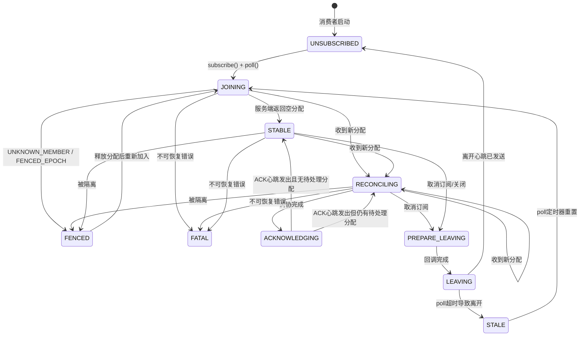

# Kafka 消费者组底层执行逻辑深度分析

> 本文基于 Apache Kafka 源码，深入分析消费者组（Consumer Group）的底层执行逻辑，重点剖析 KIP-848 新消费者组协议的完整生命周期，包括网络协议栈、线程模型和服务端状态管理。

---

## 目录

1. [架构总览](#1-架构总览)
2. [线程模型](#2-线程模型)
3. [客户端状态机](#3-客户端状态机memberstate)
4. [新消费者加入流程（端到端）](#4-新消费者加入流程端到端)
5. [服务端处理流程](#5-服务端处理流程)
6. [分区分配与调协（Reconciliation）](#6-分区分配与调协reconciliation)
7. [网络协议栈详解](#7-网络协议栈详解)
8. [经典协议 vs KIP-848 新协议对比](#8-经典协议-vs-kip-848-新协议对比)
9. [关键源文件索引](#9-关键源文件索引)

---

## 1. 架构总览

```
┌──────────────────────────────────────────────────────────────────────┐
│                        Kafka Broker                                  │
│                                                                      │
│  ┌─────────────┐    ┌──────────────────────┐    ┌──────────────────┐ │
│  │  KafkaApis   │───▶│ GroupCoordinatorService│───▶│ CoordinatorRuntime│ │
│  │  (请求路由)   │    │  (服务入口)            │    │ (事件处理引擎)    │ │
│  └─────────────┘    └──────────────────────┘    └────────┬─────────┘ │
│                                                          │           │
│                                              ┌───────────▼─────────┐ │
│                                              │GroupCoordinatorShard │ │
│                                              │  (状态机副本)         │ │
│                                              └───────────┬─────────┘ │
│                                                          │           │
│                                              ┌───────────▼─────────┐ │
│                                              │GroupMetadataManager  │ │
│                                              │  (核心逻辑引擎)       │ │
│                                              └─────────────────────┘ │
└──────────────────────────────────────────────────────────────────────┘
                              ▲  ConsumerGroupHeartbeat
                              │  Request / Response
                              ▼
┌──────────────────────────────────────────────────────────────────────┐
│                        Kafka Consumer Client                         │
│                                                                      │
│  ┌──────────────────────┐     ApplicationEvent      ┌──────────────┐ │
│  │   Application Thread  │ ────────────────────────▶ │  Consumer     │ │
│  │   (AsyncKafkaConsumer)│ ◀──────────────────────── │  Network      │ │
│  │                       │     BackgroundEvent       │  Thread       │ │
│  └──────────────────────┘                           └──────┬───────┘ │
│                                                            │         │
│                                           ┌────────────────▼───────┐ │
│                                           │  RequestManager Chain   │ │
│                                           │  ┌─ HeartbeatReqMgr    │ │
│                                           │  ├─ CoordinatorReqMgr  │ │
│                                           │  ├─ CommitReqMgr       │ │
│                                           │  └─ FetchReqMgr ...    │ │
│                                           └────────────────────────┘ │
└──────────────────────────────────────────────────────────────────────┘
```

### 核心设计思想

KIP-848 引入了**增量式心跳协议**（Incremental Heartbeat Protocol），与经典协议相比有三个根本性变化：

| 维度 | 经典协议 | KIP-848 新协议 |
|------|---------|---------------|
| **加入方式** | `JoinGroup` + `SyncGroup` 两阶段同步 | `ConsumerGroupHeartbeat` 单一 RPC |
| **线程模型** | 单线程（应用线程内处理网络 I/O） | 双线程（应用线程 + 专用网络线程） |
| **Rebalance** | Stop-the-World 全量重平衡 | 增量调协，不阻塞消费 |
| **分区分配** | 客户端执行（leader 完成分配） | 服务端执行（coordinator 使用 Assignor） |

---

## 2. 线程模型

### 2.1 双线程架构

```
Application Thread (用户调用 poll/subscribe)          Consumer Network Thread
   │                                                        │
   │  ① consumer.subscribe(topics)                          │
   │  ──▶ subscriptionState.subscribe()                     │
   │  ──▶ membershipMgr.onSubscriptionUpdated()             │
   │       ↳ subscriptionUpdated.set(true)                  │
   │                                                        │
   │  ② consumer.poll()                                     │
   │  ──▶ membershipMgr.onConsumerPoll()                    │
   │       ↳ if UNSUBSCRIBED: transitionToJoining()         │
   │  ──▶ applicationEventHandler.add(PollEvent)            │
   │                                                        │    ③ runOnce() 事件循环
   │                                                   ┌────▼────────────────┐
   │                                                   │ processApplicationEvents
   │                                                   │ → 处理 PollEvent     │
   │                                                   │ processBackgroundEvents
   │                                                   │ → 处理心跳响应等     │
   │                                                   │ requestManagers.poll()
   │                                                   │ → 各 Manager 生成请求 │
   │                                                   │ networkClient.poll()  │
   │                                                   │ → 发送网络请求       │
   │                                                   └─────────────────────┘
```

**源码位置：**
- 应用线程入口：`AsyncKafkaConsumer.poll()` → `ApplicationEventHandler`
- 网络线程主循环：`ConsumerNetworkThread.runOnce()`

### 2.2 线程间通信

```java
// Application Thread → Network Thread (ApplicationEvent)
BlockingQueue<ApplicationEvent>  applicationEventsQueue;
// 例如：PollEvent, CommitOnCloseEvent, UnsubscribeEvent

// Network Thread → Application Thread (BackgroundEvent)
BlockingQueue<BackgroundEvent> backgroundEventsQueue;
// 例如：PartitionsAssignedEvent, PartitionsRemovedEvent, ErrorEvent
```

**关键点**：两个线程通过 `BlockingQueue` 解耦。应用线程发出 `ApplicationEvent`，网络线程处理后通过 `BackgroundEvent` 通知结果。Rebalance 回调（`onPartitionsRevoked`/`onPartitionsAssigned`）在应用线程执行，但由网络线程触发。


---

## 3. 客户端状态机（MemberState）



### 各状态说明

| 状态 | 含义 | 心跳行为 |
|------|------|---------|
| `UNSUBSCRIBED` | 未订阅，不参与消费者组 | 不发送心跳 |
| `JOINING` | 正在加入，epoch=0 | 立即发送心跳（不等待间隔） |
| `RECONCILING` | 正在调协新分配 | 按间隔发送心跳 |
| `ACKNOWLEDGING` | 调协完成，等待发送 ACK | 立即发送心跳 |
| `STABLE` | 稳定状态，正常消费 | 按间隔发送心跳 |
| `FENCED` | 被服务端隔离 | 不发送心跳 |
| `PREPARE_LEAVING` | 准备离开（执行回调中） | 按间隔发送心跳 |
| `LEAVING` | 发送离开心跳 | 立即发送心跳（epoch=-1/-2） |
| `FATAL` | 不可恢复错误 | 不发送心跳 |
| `STALE` | poll 超时，等待重新加入 | 不发送心跳 |

---

## 4. 新消费者加入流程（端到端）

以下是一个新消费者从 `subscribe()` 到成功消费消息的完整步骤：

### Step 1：订阅主题（应用线程）

```
consumer.subscribe(Arrays.asList("my-topic"))
  └──▶ SubscriptionState.subscribe(topics)
  └──▶ ConsumerMembershipManager.onSubscriptionUpdated()
         └──▶ subscriptionUpdated.set(true)  // 标记订阅变更
```

此时成员仍处于 `UNSUBSCRIBED` 状态，不会触发加入。

### Step 2：触发加入（应用线程 — poll()）

```
consumer.poll(Duration.ofMillis(100))
  └──▶ AbstractMembershipManager.onConsumerPoll()
         └──▶ if (subscriptionUpdated == true && state == UNSUBSCRIBED)
                 transitionToJoining()
                   └──▶ memberEpoch = 0
                   └──▶ state: UNSUBSCRIBED → JOINING
```

**关键**：`transitionToJoining()` 将 `memberEpoch` 设为 0，这是向服务端表明"我是新成员"的信号。

### Step 3：构建并发送心跳请求（网络线程）

```
ConsumerNetworkThread.runOnce()
  └──▶ requestManagers.poll()  // 轮询所有 RequestManager
         └──▶ ConsumerHeartbeatRequestManager.poll()
                └──▶ shouldHeartbeatNow() == true  // JOINING 状态立即发送
                └──▶ buildHeartbeatRequest()
                       └──▶ heartbeatState.buildRequestData()
```

`HeartbeatState.buildRequestData()` 构建请求：

```java
ConsumerGroupHeartbeatRequestData data = new ConsumerGroupHeartbeatRequestData();
data.setGroupId(membershipManager.groupId());     // 组 ID
data.setMemberId(membershipManager.memberId());     // UUID (进程启动时生成)
data.setMemberEpoch(0);                             // 0 = 加入请求
data.setRebalanceTimeoutMs(rebalanceTimeoutMs);     // 调协超时
data.setSubscribedTopicNames(["my-topic"]);         // 订阅主题列表
data.setServerAssignor(assignor);                   // 服务端分配器（可选）
data.setTopicPartitions([]);                        // 当前分区（新成员为空）
data.setRackId(rackId);                             // 机架信息（可选）
```

当 `state == JOINING` 时，`sendAllFields = true`，所有字段都会被发送。后续心跳仅发送变更字段（增量优化）。

### Step 4：网络传输（TCP/Kafka 协议）

```
NetworkClientDelegate
  └──▶ 将 ConsumerGroupHeartbeatRequest 序列化
  └──▶ 通过 Selector (NIO) 发送到 Group Coordinator Broker
  
  协议格式: [RequestHeader | ConsumerGroupHeartbeatRequest Body]
  - API Key: CONSUMER_GROUP_HEARTBEAT (68)
  - API Version: 由协商确定
```

### Step 5：服务端接收与路由（Broker 网络线程 → 请求处理线程）

```
SocketServer (Acceptor + Processor)
  └──▶ 解析 RequestHeader，识别 API Key = CONSUMER_GROUP_HEARTBEAT
  └──▶ 放入 RequestChannel
  └──▶ KafkaRequestHandlerPool 中的 Handler 线程取出请求

KafkaApis.handle(request)
  └──▶ case ApiKeys.CONSUMER_GROUP_HEARTBEAT => handleConsumerGroupHeartbeat(request)
```

### Step 6：权限验证与请求转发（KafkaApis）

```scala
def handleConsumerGroupHeartbeat(request: RequestChannel.Request) = {
  // ① 检查新协议是否启用
  if (!isConsumerGroupProtocolEnabled()) → 返回 UNSUPPORTED_VERSION

  // ② 权限检查: READ on GROUP
  if (!authorize(request.context, READ, GROUP, groupId)) → AUTHORIZATION_FAILED

  // ③ 主题权限检查 (如果请求包含 subscribedTopicNames)
  if (subscribedTopicNames 非空) {
    authorizedTopics = filterByAuthorized(DESCRIBE, TOPIC, subscribedTopicNames)
    if (authorizedTopics < subscribedTopicNames) → TOPIC_AUTHORIZATION_FAILED
  }

  // ④ 转发到 GroupCoordinator
  groupCoordinator.consumerGroupHeartbeat(request.context, request.data)
}
```

### Step 7：CoordinatorRuntime 事件调度

```
GroupCoordinatorService.consumerGroupHeartbeat()
  └──▶ 验证请求（groupId 有效、memberEpoch ≥ -2 等）
  └──▶ runtime.scheduleWriteOperation(
         "consumer-group-heartbeat",
         topicPartitionFor(groupId),        // 根据 groupId 哈希到 __consumer_offsets 分区
         Duration.ofMillis(5000),
         coordinator -> coordinator.consumerGroupHeartbeat(context, request)
       )
```

`CoordinatorRuntime` 将操作调度到负责该 `__consumer_offsets` 分区的**事件处理线程**（EventProcessor），确保对同一分区的操作串行执行。

### Step 8：GroupMetadataManager 核心处理

```
GroupMetadataManager.consumerGroupHeartbeat(context, request)
  │
  ├── if (memberEpoch == -1 || memberEpoch == -2)
  │     └── consumerGroupLeave()  // 离开流程
  │
  └── else: consumerGroupHeartbeat(context, groupId, memberId, epoch, ...)
        │
        ├── ① 获取/创建 ConsumerGroup
        │     getOrMaybeCreatePersistedConsumerGroup(groupId, createIfNotExists=true)
        │
        ├── ② 成员管理
        │     if (memberEpoch == 0)  // 新成员加入
        │       └── 创建 ConsumerGroupMember
        │           设置 subscribedTopicNames, rackId, instanceId 等
        │     else
        │       └── 更新已有成员信息
        │
        ├── ③ 更新组订阅元数据
        │     更新 subscribedTopicNames → 计算 subscribedTopicIds
        │     更新 groupsByTopics 索引
        │
        ├── ④ 目标分配计算 (Target Assignment)
        │     if (组订阅发生变化 || 成员列表变化)
        │       └── 调用 TargetAssignmentBuilder
        │           └── 使用 ServerAssignor (如 UniformAssignor)
        │               计算每个成员的目标分配
        │
        ├── ⑤ 更新成员 epoch
        │     consumerGroupMemberEpoch = group.groupEpoch
        │
        ├── ⑥ 生成 CoordinatorRecord (持久化到 __consumer_offsets)
        │     Records:
        │       - ConsumerGroupMemberMetadataRecord
        │       - ConsumerGroupTargetAssignmentRecord
        │       - ConsumerGroupCurrentAssignmentRecord
        │       - ConsumerGroupPartitionMetadataRecord
        │
        └── ⑦ 构建响应
              ConsumerGroupHeartbeatResponseData:
                .setMemberId(memberId)
                .setMemberEpoch(新epoch)
                .setHeartbeatIntervalMs(心跳间隔)
                .setAssignment(目标分配)  // 包含分配的 TopicPartitions
```

### Step 9：响应返回与客户端处理（网络线程）

```
ConsumerHeartbeatRequestManager.onResponse(response)
  └──▶ AbstractHeartbeatRequestManager.onResponse()
         └──▶ handleSuccessResponse(response)
                └──▶ membershipManager.onHeartbeatSuccess(response)
```

```java
// ConsumerMembershipManager.onHeartbeatSuccess()
void onHeartbeatSuccess(ConsumerGroupHeartbeatResponse response) {
    // ① 更新 memberEpoch
    updateMemberEpoch(response.data().memberEpoch());

    // ② 处理分配 (如果响应包含 assignment)
    if (assignment != null) {
        Map<Uuid, SortedSet<Integer>> newAssignment = parseAssignment(assignment);
        processAssignmentReceived(newAssignment);
        // → 状态: JOINING → RECONCILING (如果分配与当前不同)
        // → 状态: JOINING → STABLE (如果分配与当前相同，如空分配)
    }
}
```

### Step 10：分区调协与回调（跨线程协作）

详见[第 6 节](#6-分区分配与调协reconciliation)。

---

## 5. 服务端处理流程

### 5.1 核心组件层次

```
KafkaApis (Scala, 请求路由层)
  ↓  handleConsumerGroupHeartbeat()
GroupCoordinatorService (Java, 服务层)
  ↓  consumerGroupHeartbeat() → 验证 + 调度
CoordinatorRuntime (Java, 并发引擎)
  ↓  scheduleWriteOperation() → 根据 __consumer_offsets 分区分派
GroupCoordinatorShard (Java, 状态机副本)
  ↓  consumerGroupHeartbeat() → 委托
GroupMetadataManager (Java, 核心逻辑, ~9000行)
  ↓  consumerGroupHeartbeat() → 执行所有业务逻辑
```

### 5.2 CoordinatorRuntime 线程模型

```
                     ┌─────────────────────────┐
                     │   CoordinatorRuntime      │
                     │                           │
scheduleWriteOp() ──▶│  EventProcessor Pool      │
                     │  ┌──────────────────────┐ │
                     │  │ EP-0: partition 0,3,6 │ │
                     │  │ EP-1: partition 1,4,7 │ │
                     │  │ EP-2: partition 2,5,8 │ │
                     │  └──────────────────────┘ │
                     │                           │
                     │  每个 EP 串行处理其负责      │
                     │  的分区上的操作              │
                     └─────────────────────────┘
```

**关键特性：**
- 同一 `__consumer_offsets` 分区上的操作**串行执行**，消除并发竞争
- 不同分区的操作可以**并行处理**，提升吞吐量
- 写操作产生的 `CoordinatorRecord` 会被追加到 `__consumer_offsets` 分区日志中，实现持久化

### 5.3 服务端消费者组状态

服务端 `ConsumerGroup` 维护的关键状态：

| 字段 | 类型 | 说明 |
|------|------|------|
| `groupId` | String | 组标识 |
| `groupEpoch` | int | 组的全局 epoch，每次分配变化递增 |
| `targetAssignmentEpoch` | int | 当前目标分配的 epoch |
| `members` | Map<String, ConsumerGroupMember> | 成员映射 |
| `subscribedTopicNames` | Set<String> | 组内所有订阅主题的并集 |
| `targetAssignment` | Map<String, Assignment> | 每个成员的目标分配 |
| `currentPartitionAssignment` | Map<String, Assignment> | 每个成员当前已确认的分配 |

---

## 6. 分区分配与调协（Reconciliation）

### 6.1 调协流程概述

```
收到新目标分配 (targetAssignment)
  │
  ▼
RECONCILING 状态
  │
  ├── ① 解析 TopicID → TopicName (从元数据缓存)
  │     如有未解析的 TopicID → 触发元数据更新请求
  │
  ├── ② maybeReconcile(canCommit=true)
  │     ├── 计算 addedPartitions = 新分配 - 当前拥有
  │     ├── 计算 revokedPartitions = 当前拥有 - 新分配
  │     │
  │     ├── ③ 自动提交偏移量 (如果启用 auto-commit)
  │     │     signalReconciliationStarted()
  │     │     └── commitRequestManager.maybeAutoCommitSyncBeforeRebalance()
  │     │
  │     ├── ④ 标记待撤销分区 → 暂停从这些分区拉取
  │     │     markPendingRevocationToPauseFetching(revokedPartitions)
  │     │
  │     ├── ⑤ 触发 onPartitionsRevoked 回调
  │     │     revokePartitions(revokedPartitions)
  │     │     └── 网络线程发出 PartitionsRemovedEvent
  │     │         └── 应用线程执行用户回调
  │     │         └── 完成后发送 CallbackCompletedEvent 回网络线程
  │     │
  │     ├── ⑥ 更新分配 + 触发 onPartitionsAssigned 回调
  │     │     assignPartitions(assignedPartitions, addedPartitions)
  │     │     └── 网络线程发出 PartitionsAssignedEvent
  │     │         └── 应用线程：
  │     │             - 更新 SubscriptionState 分配
  │     │             - 执行 onPartitionsAssigned 回调
  │     │         └── 完成后发送 CallbackCompletedEvent
  │     │
  │     └── ⑦ 调协完成
  │           currentAssignment = resolvedAssignment
  │           状态: RECONCILING → ACKNOWLEDGING
  │
  ▼
ACKNOWLEDGING 状态
  │
  └── 下一次心跳自动发送 ACK
      心跳包含 currentAssignment (topicPartitions 字段)
      └── 服务端更新 currentPartitionAssignment
      └── 状态: ACKNOWLEDGING → STABLE (无待处理分配)
                ACKNOWLEDGING → RECONCILING (仍有待处理分配)
```

### 6.2 跨线程回调机制

```
网络线程                                     应用线程
   │                                            │
   │  PartitionsRemovedEvent                     │
   │  ──────────────────────────────────────▶    │
   │  (包含 CompletableFuture)                   │
   │                                            │
   │                            执行 onPartitionsRevoked()
   │                                            │
   │          CallbackCompletedEvent             │
   │  ◀──────────────────────────────────────    │
   │  (complete CompletableFuture)               │
   │                                            │
   │  PartitionsAssignedEvent                    │
   │  ──────────────────────────────────────▶    │
   │                                            │
   │                          applyAssignment()  │
   │                    + onPartitionsAssigned()  │
   │                                            │
   │          CallbackCompletedEvent             │
   │  ◀──────────────────────────────────────    │
   │                                            │
   │  调协完成，发送 ACK 心跳                      │
```

---

## 7. 网络协议栈详解

### 7.1 ConsumerGroupHeartbeat 请求/响应格式

**请求 (API Key = 68):**

```
ConsumerGroupHeartbeatRequest {
  GroupId           : String        // 消费者组ID
  MemberId          : String        // 成员ID (UUID, 客户端生成)
  MemberEpoch       : int32         // 0=加入, -1=离开, -2=静态成员离开
  InstanceId        : String?       // 静态成员ID (可选)
  RackId            : String?       // 机架ID (可选)
  RebalanceTimeoutMs: int32         // 调协超时时间
  SubscribedTopicNames: [String]    // 订阅主题列表
  SubscribedTopicRegex: String?     // 正则订阅模式 (可选)
  ServerAssignor    : String?       // 服务端分配器名称 (可选)
  TopicPartitions   : [TopicPartitions] // 当前拥有的分区
}
```

**响应:**

```
ConsumerGroupHeartbeatResponse {
  ThrottleTimeMs    : int32         // 限流时间
  ErrorCode         : int16         // 错误码
  ErrorMessage      : String?       // 错误详情
  MemberId          : String        // 确认的成员ID
  MemberEpoch       : int32         // 新的成员epoch
  HeartbeatIntervalMs: int32        // 服务端指定的心跳间隔
  Assignment        : Assignment?   // 新的目标分配 (仅变化时返回)
}

Assignment {
  TopicPartitions: [{
    TopicId    : UUID              // 主题UUID
    Partitions : [int32]           // 分区列表
  }]
}
```

### 7.2 增量心跳优化

`HeartbeatState` 维护了 `SentFields` 缓存，实现只发送变更字段：

```java
// 关键逻辑 (ConsumerHeartbeatRequestManager.HeartbeatState)
boolean sendAllFields = (state == MemberState.JOINING);  // 加入时发送全量

// SubscribedTopicNames - 仅变化时发送
if (sendAllFields || !subscribedTopicNames.equals(sentFields.subscribedTopicNames)) {
    data.setSubscribedTopicNames(...);
    sentFields.subscribedTopicNames = subscribedTopicNames;
}

// TopicPartitions - 仅在加入或分配变化时发送
if (sendAllFields || !local.equals(sentFields.localAssignment)) {
    data.setTopicPartitions(buildTopicPartitionsList(local.partitions));
    sentFields.localAssignment = local;
}
```

这意味着稳定状态下的心跳请求非常轻量，仅包含 `groupId`, `memberId`, `memberEpoch` 三个字段。

### 7.3 MemberEpoch 语义

| Epoch 值 | 含义 |
|----------|------|
| `0` | 新成员请求加入 |
| `> 0` | 正常心跳，epoch 由服务端递增管理 |
| `-1` | 动态成员离开 |
| `-2` | 静态成员暂时离开（会话内可重新加入） |

---

## 8. 经典协议 vs KIP-848 新协议对比

### 8.1 加入流程对比

```
=== 经典协议 ===                        === KIP-848 新协议 ===
Consumer          Coordinator           Consumer          Coordinator
   │                   │                   │                   │
   │──FindCoordinator─▶│                   │──FindCoordinator─▶│
   │◀─Response─────────│                   │◀─Response─────────│
   │                   │                   │                   │
   │──JoinGroup───────▶│                   │──Heartbeat(e=0)──▶│
   │   (阻塞等待)       │                   │◀─Response + Assign─│
   │◀─JoinResponse─────│                   │      (非阻塞)       │
   │                   │                   │                   │
   │──SyncGroup───────▶│                   │  本地调协分配        │
   │   (阻塞等待)       │                   │  (commit/revoke/   │
   │◀─SyncResponse─────│                   │   assign callbacks)│
   │     + Assignment   │                   │                   │
   │                   │                   │──Heartbeat(ACK)───▶│
   │  开始消费          │                   │   (发送确认)         │
   │                   │                   │                   │
                                           │  开始消费           │
```

### 8.2 Rebalance 行为对比

| 方面 | 经典协议 | KIP-848 |
|------|---------|---------|
| **触发条件** | 任何成员变化 → 全组 Rebalance | 增量调整，仅影响相关成员 |
| **消费中断** | 全组停止消费等待 Rebalance 完成 | 未受影响的成员继续消费 |
| **分配计算** | Leader 消费者在客户端执行 | 服务端 Coordinator 使用 Assignor |
| **协议流程** | JoinGroup → SyncGroup (两阶段) | 单一 ConsumerGroupHeartbeat |
| **成员管理** | 会话超时 (Session Timeout) | 心跳超时 + 调协超时 (Sync Timeout) |

### 8.3 线程模型对比

```
=== 经典协议 (单线程) ===

Application Thread
  poll() ──▶ sendFetches()
         ──▶ coordinatorHeartbeat()     // 心跳在同一线程
         ──▶ handleJoinGroup()          // 阻塞加入
         ──▶ handleSyncGroup()          // 阻塞同步
         ──▶ onPartitionsRevoked()      // 同线程回调
         ──▶ onPartitionsAssigned()     // 同线程回调


=== KIP-848 (双线程) ===

Application Thread              Consumer Network Thread
  poll() ──▶ processEvents()     runOnce() ──▶ heartbeatMgr.poll()
         ──▶ processCallbacks()            ──▶ fetchMgr.poll()
         ──▶ onPartitionsRevoked()         ──▶ commitMgr.poll()
         ──▶ onPartitionsAssigned()        ──▶ networkClient.poll()
```

---

## 9. 关键源文件索引

### 客户端 (`clients/src/main/java/.../consumer/internals/`)

| 文件 | 职责 |
|------|------|
| `AsyncKafkaConsumer.java` | KIP-848 消费者实现入口 |
| `ConsumerNetworkThread.java` | 后台网络线程，事件循环 |
| `ConsumerHeartbeatRequestManager.java` | 构建/发送心跳请求 |
| `AbstractHeartbeatRequestManager.java` | 心跳请求管理基类（定时、重试） |
| `ConsumerMembershipManager.java` | 消费者组成员身份管理 |
| `AbstractMembershipManager.java` | 成员状态机和调协逻辑基类 |
| `MemberState.java` | 10 个状态枚举及合法转换 |

### 服务端 (`group-coordinator/src/main/java/.../group/`)

| 文件 | 职责 |
|------|------|
| `GroupCoordinatorService.java` | 服务入口，请求验证与调度 |
| `GroupCoordinatorShard.java` | 状态机副本，委托核心逻辑 |
| `GroupMetadataManager.java` | 核心逻辑引擎（~9000 行），处理心跳、分配、状态转换 |
| `CoordinatorRuntime` | 多线程事件处理引擎 |

### 请求路由

| 文件 | 职责 |
|------|------|
| `KafkaApis.scala` | `handleConsumerGroupHeartbeat()` — 权限验证 + 转发 |

---

> **总结**：KIP-848 新协议通过将分区分配决策移至服务端、引入增量心跳机制、以及采用双线程模型，本质上消除了经典协议中 Stop-the-World 式 Rebalance 的性能瓶颈。客户端的 `ConsumerMembershipManager` 通过 10 个状态的精密状态机，与服务端 `GroupMetadataManager` 协同完成成员加入、分配调协、ACK 确认的完整生命周期。
