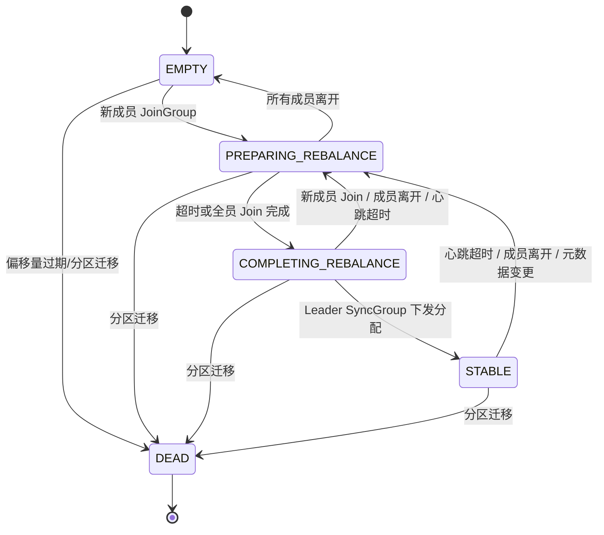
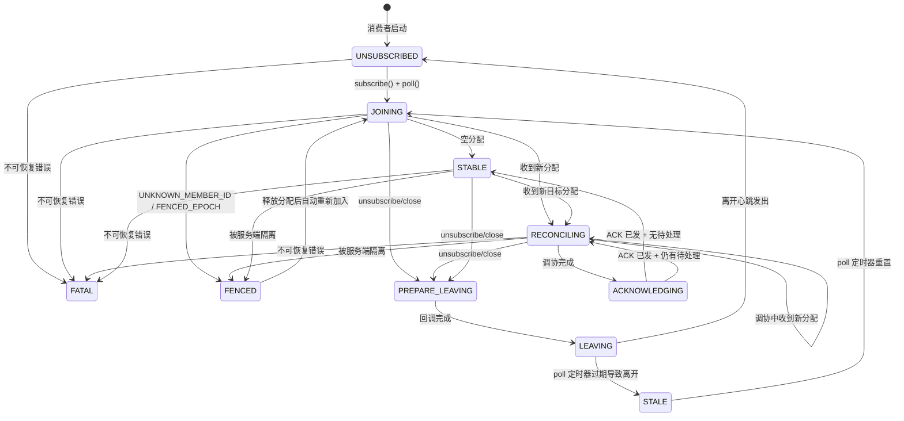
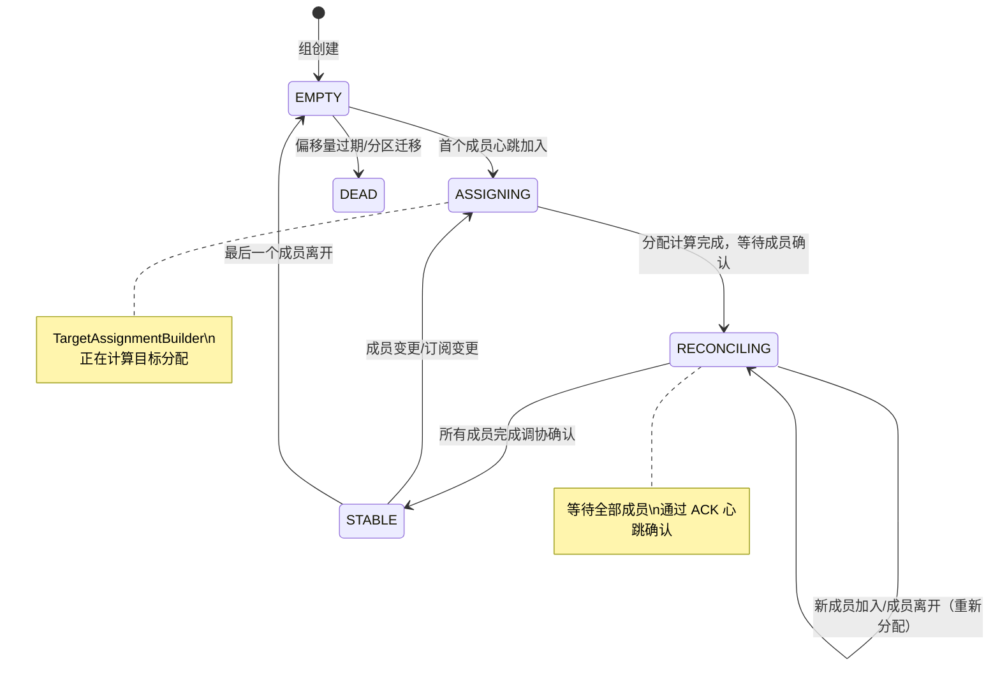

# Kafka 消费者重平衡机制底层运行原理深度分析

> 本文基于 Apache Kafka 最新源码，系统性剖析消费者组（Consumer Group）重平衡（Rebalance）机制的底层运行原理。涵盖经典协议的同步两阶段模型、KIP-848 新协议的增量心跳模型、客户端/服务端双维度状态机转换，以及 SDK 端在重平衡期间可能遭遇的各类故障场景与行为表现。

---

## 目录

1. [经典重平衡协议底层原理](#一经典重平衡协议底层原理-classic-group-protocol)
2. [KIP-848 新协议的核心变革](#二kip-848-新世代消费者组协议的核心变革)
3. [客户端状态机对比分析](#三客户端状态机对比分析)
4. [服务端状态机对比分析](#四服务端状态机对比分析)
5. [服务端分区分配引擎](#五服务端分区分配引擎)
6. [增量调协流程详解](#六增量调协reconciliation流程详解)
7. [心跳错误处理与容错机制](#七心跳错误处理与容错机制)
8. [SDK 端在重平衡下的行为表现](#八sdk-端在重平衡下的行为表现与故障场景)
9. [关键源文件索引](#九关键源文件索引)

---

## 一、经典重平衡协议底层原理 (Classic Group Protocol)

### 1.1 协议交互模型

经典协议依赖 `JoinGroup` + `SyncGroup` 两阶段**同步阻塞**模型完成重平衡。整个过程由客户端侧 `ConsumerCoordinator` 与 Broker 侧 `GroupCoordinator`（`ClassicGroup`）协同驱动。

```
Consumer-A (Leader)        Coordinator (Broker)         Consumer-B (Follower)
     │                          │                             │
     │── FindCoordinator ──────▶│◀── FindCoordinator ─────────│
     │◀── Response ─────────────│── Response ────────────────▶│
     │                          │                             │
     │                 ┌────────┤                             │
     │── JoinGroup ───▶│ PREPAR │◀── JoinGroup ──────────────│
     │   (block...)    │  ING   │    (block...)               │
     │                 │REBALANC│                             │
     │                 │   E    │  等待所有成员 Join 或超时      │
     │                 └────┬───┘                             │
     │◀── JoinResponse ────┤── JoinResponse ────────────────▶│
     │   (leader=true)     │   (leader=false)                │
     │   +成员订阅信息       │                                 │
     │                     │                                  │
     │  本地执行分区分配算法   │                                  │
     │  (RangeAssignor等)   │                                  │
     │                     │                                  │
     │── SyncGroup ───────▶│◀── SyncGroup ──────────────────│
     │   (含分配结果)        │    (空Assignment)               │
     │                 ┌───┤                                  │
     │                 │ COM│                                  │
     │                 │PLET│   Coordinator 下发分配            │
     │                 │ ING│                                  │
     │                 │REBA│                                  │
     │                 │LANC│                                  │
     │                 │  E │                                  │
     │                 └─┬──┘                                 │
     │◀─ SyncResponse ──┤── SyncResponse ──────────────────▶│
     │   (Assignment)    │   (Assignment)                    │
     │                   │                                   │
     │   STABLE 状态       │    STABLE 状态                    │
```

### 1.2 服务端经典状态机 (`ClassicGroupState`)

源码位置：`group-coordinator/.../classic/ClassicGroupState.java`



每个状态的行为定义（摘自源码注释）：

| 状态 | 对 Heartbeat 的响应 | 对 JoinGroup 的响应 | 触发条件 |
|------|-------------------|-------------------|---------|
| **EMPTY** | `UNKNOWN_MEMBER_ID` | 正常处理，转入 Rebalance | 无成员或仅用于 Offset 提交 |
| **PREPARING_REBALANCE** | `REBALANCE_IN_PROGRESS` | 阻塞等待（park） | 有成员发起 Join |
| **COMPLETING_REBALANCE** | `REBALANCE_IN_PROGRESS` | 触发新一轮 Rebalance | Leader 被选举出，等待 SyncGroup |
| **STABLE** | 正常响应 | 触发新一轮 Rebalance | Leader Sync 完成，分配下发 |
| **DEAD** | `UNKNOWN_MEMBER_ID` | `UNKNOWN_MEMBER_ID` | 终态，元数据清理中 |

### 1.3 经典协议的根本缺陷

1. **Stop-the-World（全局停顿）**：一旦重平衡触发，**所有成员必须撤销全部分区**，在 `PREPARING_REBALANCE` 阶段阻塞等待，直至整个 Rebalance 流程完成，整个消费者组的消费吞吐降为零。

2. **客户端分配（胖客户端）**：Leader 消费者在客户端本地执行分区分配算法（`RangeAssignor` / `RoundRobinAssignor` / `StickyAssignor`），不同客户端版本或配置差异可能导致分配冲突。

3. **心跳与 Poll 耦合**：心跳发送内嵌于 `poll()` 调用路径中，业务处理缓慢导致 `poll()` 间隔超出 `max.poll.interval.ms` 时，会因会话超时被误踢出组，引发级联 Rebalance。

---

## 二、KIP-848 新世代消费者组协议的核心变革

### 2.1 协议重构：单一异步心跳替代两阶段同步

KIP-848 废弃 `JoinGroup` / `SyncGroup` 双阶段流程，全面采用单一 **`ConsumerGroupHeartbeat`** RPC（API Key = 68）实现成员管理、状态同步与分配下发。

```
消费者                             Coordinator (Broker)
   │                                    │
   │── Heartbeat(epoch=0) ────────────▶│  创建/加入组
   │    (全量字段：groupId, memberId,    │  运行 ServerAssignor
   │     subscribedTopics, rackId等)    │  计算分配
   │◀── Response(epoch=1, assignment) ──│  返回目标分配
   │                                    │
   │  本地调协 (commit/revoke/assign)    │
   │  不阻塞消费                          │
   │                                    │
   │── Heartbeat(epoch=1, ACK) ────────▶│  确认分配生效
   │    (topicPartitions=当前拥有的)      │
   │◀── Response(epoch=1) ──────────────│  STABLE
   │                                    │
   │── Heartbeat(epoch=1) ─────────────▶│  普通心跳（增量字段）
   │    (仅 groupId/memberId/epoch)     │
   │◀── Response ───────────────────────│
```

### 2.2 双线程解耦架构

KIP-848 引入了 `ConsumerNetworkThread`，将网络 I/O 与业务逻辑彻底解耦：

```
┌────────────────────────────────────┐    ┌────────────────────────────────────┐
│       Application Thread            │    │     Consumer Network Thread         │
│  (用户代码: poll/subscribe/close)    │    │  (后台守护线程, 独立运行)             │
│                                    │    │                                    │
│  consumer.subscribe()              │    │  while(running) {                  │
│    → SubscriptionState.subscribe() │    │    processApplicationEvents();     │
│    → membershipMgr.onSubscription  │    │    // ↑ 处理来自应用线程的事件         │
│         Updated()                  │    │                                    │
│                                    │    │    for(RequestManager rm : mgrs) { │
│  consumer.poll()                   │    │      rm.poll();                    │
│    → membershipMgr.onConsumerPoll()│    │    }                               │
│    → applicationEventHandler       │    │    // ↑ 各Manager生成请求:           │
│        .add(PollEvent)             │    │    //   heartbeatMgr → 心跳请求     │
│                                    │    │    //   fetchMgr → 拉取请求          │
│  // 消费消息、处理业务...             │    │    //   commitMgr → 提交请求        │
│                                    │    │                                    │
│  处理 BackgroundEvent:              │    │    networkClient.poll();            │
│    → onPartitionsRevoked()         │    │    // ↑ NIO 发送/接收               │
│    → onPartitionsAssigned()        │    │  }                                 │
│                                    │    │                                    │
│  ←── BackgroundEvent ──────────────│◀───│── BackgroundEventHandler ──────────│
│  ───▶ ApplicationEvent ───────────▶│───▶│── ApplicationEventQueue ──────────▶│
└────────────────────────────────────┘    └────────────────────────────────────┘
```

源码位置：`AsyncKafkaConsumer.java`（应用线程入口）、`ConsumerNetworkThread.runOnce()`（网络线程主循环）。

**核心优势**：`max.poll.interval.ms` 超时仅导致成员主动"自我放逐"（transitionToStale），而非被 Broker 误踢。心跳由后台线程独立维护，不再受业务处理阻塞影响。

### 2.3 服务端中心化分配

分配计算从客户端迁移至服务端 Coordinator：

```
GroupMetadataManager
  └── consumerGroupHeartbeat()
        └── TargetAssignmentBuilder.build()
              └── PartitionAssignor.assign()   // 接口
                    └── UniformAssignor          // 默认实现
                          ├── 同质订阅 → UniformHomogeneousAssignmentBuilder
                          └── 异质订阅 → UniformHeterogeneousAssignmentBuilder
```

`UniformAssignor`（源码：`assignor/UniformAssignor.java`）根据订阅类型自动选择策略：
- **同质订阅（Homogeneous）**：所有成员订阅相同主题集，使用最优化的均匀分配
- **异质订阅（Heterogeneous）**：成员订阅不同主题，使用更灵活的加权分配

### 2.4 变革总结

| 维度 | 经典协议 | KIP-848 新协议 |
|------|---------|---------------|
| **RPC 协议** | `JoinGroup` + `SyncGroup` 两阶段同步 | `ConsumerGroupHeartbeat` 单一异步 |
| **线程模型** | 单线程（心跳内嵌于 poll） | 双线程（网络线程独立心跳） |
| **Rebalance 影响范围** | 全组 Stop-the-World | 仅涉及分区变化的成员 |
| **分配计算** | 客户端 Leader 执行 | 服务端 Coordinator 执行 |
| **心跳传输** | 初始全量，后续仅状态维持 | 初始全量，后续增量（仅发送变更字段） |
| **成员标识** | Coordinator 分配 memberId | 客户端启动时生成 UUID（进程级持久） |

---

## 三、客户端状态机对比分析

### 3.1 经典协议状态机

经典协议客户端仅维护 4 个粗粒度状态：

```
UNJOINED ──▶ PREPARING_REBALANCE ──▶ COMPLETING_REBALANCE ──▶ STABLE
   ▲                                                            │
   └────────────────────────────────────────────────────────────┘
                      (任意异常/超时/离开)
```

### 3.2 KIP-848 客户端状态机（`MemberState`）

源码位置：`clients/.../consumer/internals/MemberState.java`

新协议在客户端引入了 **10 个细粒度状态**，精确控制增量调协的异步操作链：



### 3.3 各状态详解

| 状态 | 含义 | 心跳行为 | 是否消费 |
|------|------|---------|---------|
| **UNSUBSCRIBED** | 未订阅或已取消订阅 | ❌ 不发送 | ❌ |
| **JOINING** | 首次加入或 Fenced 后重新加入，epoch=0 | ✅ 立即发送（不等间隔） | ❌ |
| **RECONCILING** | 收到新目标分配，正在调协 | ✅ 按间隔发送 | ✅ 继续消费已有分区 |
| **ACKNOWLEDGING** | 调协完成，等待发出 ACK 心跳 | ✅ 立即发送 | ✅ |
| **STABLE** | 稳定运行，无待调协分配 | ✅ 按间隔发送 | ✅ |
| **FENCED** | 被 Coordinator 隔离（epoch 过期） | ❌ 不发送 | ❌ 释放分配中 |
| **PREPARE_LEAVING** | 准备离开，执行回调中 | ✅ 按间隔发送 | ⚠️ 逐步释放 |
| **LEAVING** | 发送 epoch=-1/-2 的离开心跳 | ✅ 立即发送 | ❌ |
| **FATAL** | 不可恢复错误，终态 | ❌ 不发送 | ❌ |
| **STALE** | poll 超时自我放逐 | ❌ 不发送 | ❌ 释放分配中 |

**关键设计要点**（源码 `MemberState.java` 第 118-142 行）：

```java
// 合法的状态转换规则
STABLE.previousValidStates = [JOINING, ACKNOWLEDGING, RECONCILING];
RECONCILING.previousValidStates = [STABLE, JOINING, ACKNOWLEDGING, RECONCILING];
ACKNOWLEDGING.previousValidStates = [RECONCILING];
FENCED.previousValidStates = [JOINING, STABLE, RECONCILING, ACKNOWLEDGING,
                              PREPARE_LEAVING, LEAVING];
JOINING.previousValidStates = [FENCED, UNSUBSCRIBED, STALE];
LEAVING.previousValidStates = [PREPARE_LEAVING];
STALE.previousValidStates = [LEAVING];
```

---

## 四、服务端状态机对比分析

### 4.1 KIP-848 服务端消费者组状态（`ConsumerGroupState`）

源码位置：`modern/consumer/ConsumerGroup.java`



| 状态 | 含义 | 触发条件 |
|------|------|---------|
| **EMPTY** | 无活跃成员 | 初始状态或所有成员离开 |
| **ASSIGNING** | 成员列表/订阅发生变化，正在计算新分配 | 成员加入/离开/订阅变更 |
| **RECONCILING** | 新分配已计算，等待**所有受影响成员**通过心跳 ACK | 分配计算完成 |
| **STABLE** | 所有成员已确认其目标分配 | 全员 ACK 完成 |
| **DEAD** | 组元数据正在清理 | 终态 |

### 4.2 经典 vs KIP-848 服务端状态对比

| 经典协议 | KIP-848 | 对应关系 |
|---------|---------|---------|
| `EMPTY` | `EMPTY` | 直接对应 |
| `PREPARING_REBALANCE` | `ASSIGNING` | 功能类似：等待/计算分配 |
| `COMPLETING_REBALANCE` | `RECONCILING` | 功能类似：等待成员确认 |
| `STABLE` | `STABLE` | 直接对应 |
| `DEAD` | `DEAD` | 直接对应 |

**本质区别**：经典协议中 `PREPARING_REBALANCE` 阶段**阻塞**所有成员等待 Join 完成；KIP-848 的 `ASSIGNING` 状态下 Coordinator **异步**计算分配，成员继续正常心跳和消费。

---

## 五、服务端分区分配引擎

### 5.1 分配计算架构

```
consumerGroupHeartbeat()                    [GroupMetadataManager]
  │
  ├── 检测是否需要重新分配:
  │   - 成员订阅变化 (subscribedTopicNames 变更)
  │   - 成员列表变化 (新成员加入/成员离开)
  │   - 元数据变化 (Topic 分区数变更)
  │
  └── 如果需要 → TargetAssignmentBuilder.build()
        │
        ├── ① 构建 MemberSpec (每个成员的订阅+当前分配)
        │     members.forEach → MemberSubscriptionAndAssignmentImpl
        │
        ├── ② 调用 PartitionAssignor.assign():
        │     └── UniformAssignor.assign()
        │           ├── 同质：UniformHomogeneousAssignmentBuilder
        │           └── 异质：UniformHeterogeneousAssignmentBuilder
        │
        ├── ③ 计算 Delta (新旧分配差异)
        │     for each member:
        │       if newAssignment != oldAssignment:
        │         records.add(TargetAssignmentRecord)
        │
        └── ④ 递增 targetAssignmentEpoch
              records.add(TargetAssignmentMetadataRecord)
```

### 5.2 Epoch 管理语义

服务端维护三个关键 epoch 层级：

```
ConsumerGroup:
  ├── groupEpoch              // 组级别 epoch，成员列表/订阅变化时递增
  ├── targetAssignmentEpoch   // 目标分配 epoch，每次重新分配时递增
  └── members[memberId]:
        └── memberEpoch       // 成员级别 epoch，ACK 确认后更新
```

**分配收敛判定**：当所有成员的 `memberEpoch == targetAssignmentEpoch` 时，组进入 `STABLE` 状态。

### 5.3 持久化记录类型

重平衡过程产生的 `CoordinatorRecord`，持久化到 `__consumer_offsets` topic：

| Record 类型 | 写入时机 |
|------------|---------|
| `ConsumerGroupMemberMetadataRecord` | 成员加入/更新订阅 |
| `ConsumerGroupTargetAssignmentRecord` | 目标分配变更（逐成员） |
| `ConsumerGroupTargetAssignmentMetadataRecord` | 分配 epoch 递增 |
| `ConsumerGroupCurrentAssignmentRecord` | 成员 ACK 确认分配 |
| `ConsumerGroupPartitionMetadataRecord` | 订阅元数据变更 |

---

## 六、增量调协（Reconciliation）流程详解

`AbstractMembershipManager.maybeReconcile()` 实现了客户端侧的核心调协逻辑：

```
            ┌──────────────────────────────────────────────────────┐
            │            RECONCILING 状态                           │
            │                                                      │
            │  ① TopicID 解析                                       │
            │    findResolvableAssignmentAndTriggerMetadataUpdate() │
            │    TopicID (UUID) → TopicName (从 Metadata 缓存)      │
            │    未解析的 → 触发元数据更新请求，下次再协调              │
            │                                                      │
            │  ② 计算分区变更                                        │
            │    addedPartitions   = 新分配 - 当前拥有                │
            │    revokedPartitions = 当前拥有 - 新分配                │
            │                                                      │
            │  ③ Auto-Commit (如果启用)                              │
            │    commitRequestManager.maybeAutoCommitSync            │
            │      BeforeRebalance(deadline)                        │
            │    (超时时限 = rebalanceTimeoutMs)                     │
            │                                                      │
            │  ④ 暂停待撤销分区的拉取                                │
            │    markPendingRevocationToPauseFetching()              │
            │    (停止发送新的 Fetch 请求，不处理已收到的响应)          │
            │                                                      │
            │  ⑤ 触发 onPartitionsRevoked (跨线程)                   │
            │    NetworkThread → PartitionsRemovedEvent →            │
            │                    AppThread 执行回调 →                │
            │                    CallbackCompletedEvent →           │
            │                    NetworkThread 继续                  │
            │                                                      │
            │  ⑥ 触发 onPartitionsAssigned (跨线程)                  │
            │    NetworkThread → PartitionsAssignedEvent →           │
            │                    AppThread:                         │
            │                      applyAssignment()               │
            │                      执行 onPartitionsAssigned 回调    │
            │                    CallbackCompletedEvent →           │
            │                    NetworkThread 继续                  │
            │                                                      │
            │  ⑦ 调协完成                                            │
            │    currentAssignment = resolvedAssignment             │
            │    resetAutoCommitTimer()                             │
            │    状态 → ACKNOWLEDGING                                │
            └──────────────────────────────────────────────────────┘
                              │
                              ▼
            ┌──────────────────────────────────────────────────────┐
            │          ACKNOWLEDGING 状态                           │
            │                                                      │
            │  下一次心跳循环自动发送 ACK:                              │
            │    心跳请求包含 topicPartitions = 当前拥有分区           │
            │    服务端更新 currentPartitionAssignment               │
            │                                                      │
            │  onHeartbeatRequestGenerated():                      │
            │    if targetAssignmentReconciled():                   │
            │      → STABLE (全部调协完成)                           │
            │    else:                                             │
            │      → RECONCILING (仍有未解析分配待处理)               │
            └──────────────────────────────────────────────────────┘
```

### 调协中止机制

源码 `AbstractMembershipManager.maybeAbortReconciliation()`：

```java
boolean shouldAbort = state != MemberState.RECONCILING
                   || rejoinedWhileReconciliationInProgress;
```

两种中止场景：
1. 成员在调协过程中离开了 `RECONCILING` 状态（如触发 FATAL/LEAVING）
2. 成员在调协过程中**重新加入**了组（Fenced 后 rejoin），此时旧的调协结果无效

---

## 七、心跳错误处理与容错机制

源码位置：`AbstractHeartbeatRequestManager.onErrorResponse()`

### 7.1 错误分类处理矩阵

| 错误码 | 严重性 | 处理策略 | 状态转换 |
|--------|--------|---------|---------|
| `NOT_COORDINATOR` | 可恢复 | 标记 Coordinator 未知，重新发现 | 跳过退避，立即重试 |
| `COORDINATOR_NOT_AVAILABLE` | 可恢复 | 标记 Coordinator 未知 | 跳过退避，立即重试 |
| `COORDINATOR_LOAD_IN_PROGRESS` | 可恢复 | 等待退避后重试 | 保持当前状态 |
| `FENCED_MEMBER_EPOCH` | 需重入 | 触发 Fenced 流程 | → `FENCED` → `JOINING` |
| `UNKNOWN_MEMBER_ID` | 需重入 | 触发 Fenced 流程 | → `FENCED` → `JOINING` |
| `GROUP_AUTHORIZATION_FAILED` | 致命 | 抛出异常到应用线程 | → `FATAL` |
| `TOPIC_AUTHORIZATION_FAILED` | 可恢复 | 传播错误事件到应用线程 | 保持当前状态 |
| `GROUP_MAX_SIZE_REACHED` | 致命 | 抛出异常 | → `FATAL` |
| `UNSUPPORTED_ASSIGNOR` | 致命 | 抛出异常 | → `FATAL` |
| `UNSUPPORTED_VERSION` | 致命 | 新协议不受支持 | → `FATAL` |
| `UNRELEASED_INSTANCE_ID` | 致命 | 静态实例未释放 | → `FATAL` |
| `FENCED_INSTANCE_ID` | 致命 | 静态实例被其他进程占用 | → `FATAL` |
| `INVALID_REGULAR_EXPRESSION` | 致命 | 正则表达式格式错误 | → `FATAL` |

### 7.2 Fenced 恢复流程

当收到 `FENCED_MEMBER_EPOCH` 或 `UNKNOWN_MEMBER_ID` 时：

```
AbstractHeartbeatRequestManager.onErrorResponse()
  └── membershipManager.transitionToFenced()
        ├── 状态 → FENCED
        ├── resetEpoch() → memberEpoch = 0
        ├── signalPartitionsLost(当前全部分区)
        │     └── 网络线程 → PartitionsRemovedEvent → 应用线程
        │           └── 执行 onPartitionsLost() 回调
        │           └── CallbackCompletedEvent → 网络线程
        ├── clearAssignment() → 清空所有分配状态
        └── transitionToJoining() → 状态变为 JOINING
              └── 下一次心跳以 epoch=0 重新加入

同时: heartbeatRequestState.reset()
        → 跳过退避，立即触发重新加入的心跳
```

### 7.3 Poll 超时保护机制

源码位置：`AbstractHeartbeatRequestManager.poll()` 第 170-184 行。

```java
pollTimer.update(currentTimeMs);
if (pollTimer.isExpired() && !membershipManager().isLeavingGroup()) {
    // poll 超时 → 主动离开组
    membershipManager().transitionToSendingLeaveGroup(true);
    // 发出 epoch=-1 的离开心跳
    NetworkClientDelegate.UnsentRequest leaveHeartbeat =
        makeHeartbeatRequest(currentTimeMs, true);
    // 状态变化: → PREPARE_LEAVING → LEAVING → STALE
}
```

后续流程：
1. `LEAVING` → 发送离开心跳后 → `STALE`
2. `STALE` → 触发 `onPartitionsLost()` → 清空分配
3. `STALE` → **等待** `poll()` 被再次调用 → `resetPollTimer()` → `JOINING`（重新加入）

---

## 八、SDK 端在重平衡下的行为表现与故障场景

### 8.1 增量无感调协（Background Reconciliation）

**表现**：新协议下，SDK 用户调用 `consumer.poll()` 时**不再被 Rebalance 阻塞**。分区的撤销与分配在后台网络线程驱动下与应用线程协作完成，用户通过注册的 `ConsumerRebalanceListener` 在 `poll()` 返回时平滑地执行分区释放与获取。

**源码依据**：`ConsumerMembershipManager.onHeartbeatSuccess()` 收到新分配后仅设置目标分配并转入 `RECONCILING` 状态，不阻塞当前的消费循环。后续的调协在下一次 `poll()` 循环中通过事件驱动完成。

**实际影响**：
- 未受分区变化影响的成员**完全无感知**，持续正常消费
- 受影响成员在 `poll()` 返回间隙完成回调执行，延迟不超过一个 poll 周期

### 8.2 Fenced Member (成员被隔离) 场景

**触发条件**：
- 网络分区导致心跳超时，Coordinator 主动将成员 epoch 标记为过期
- 成员长时间未发送心跳（如 GC 暂停），Coordinator 执行隔离超时

**SDK 行为**：
1. 心跳响应返回 `FENCED_MEMBER_EPOCH` 或 `UNKNOWN_MEMBER_ID`
2. 回调 `onPartitionsLost()` 被触发（注意是 **Lost** 而非 **Revoked**，语义上表示分区可能已被其他成员消费）
3. 清空全部分配状态
4. 自动以 `epoch=0` 重新发送心跳加入组
5. **用户无需手动干预**，SDK 自动完成恢复

**注意**：被隔离期间的未提交偏移量将丢失。如果启用了自动提交，最后一次自动提交的偏移量之后的消息可能被重复消费。

### 8.3 Static Membership (静态成员) 冲突

**场景**：配置了 `group.instance.id` 的静态成员，当原实例尚在组内时，新实例使用相同 Instance ID 尝试加入。

**SDK 行为**：
- 新实例会收到 `UNRELEASED_INSTANCE_ID` 错误 → 进入 `FATAL` 状态
- 原实例若被替换，会收到 `FENCED_INSTANCE_ID` 错误 → 进入 `FATAL` 状态
- **FATAL 是终态**，SDK 不会自动恢复，用户必须：
  1. 关闭冲突的消费者实例
  2. 确保同一 `group.instance.id` 在组内唯一
  3. 重新创建消费者

源码依据：`ConsumerHeartbeatRequestManager.handleSpecificExceptionInResponse()` 第 136-149 行直接调用 `handleFatalFailure()`。

### 8.4 版本不兼容

**场景**：使用新版 SDK（配置 `group.protocol=consumer`）连接未启用新协议的 Broker。

**SDK 行为**：
- 发送 `ConsumerGroupHeartbeatRequest` 时，若 Broker API 版本协商失败 → 客户端抛出 `UnsupportedVersionException`
- 或 Broker 返回 `UNSUPPORTED_VERSION` 错误码
- SDK 进入 `FATAL` 状态，抛出异常：*"The cluster does not support the new CONSUMER group protocol. Set group.protocol=classic on the consumer configs to revert to the CLASSIC protocol until the cluster is upgraded."*

**处理建议**：在配置中设置 `group.protocol=classic` 回退到经典协议。

### 8.5 Poll 超时自我放逐 (Stale Member)

**场景**：业务处理过慢，连续两次 `poll()` 间隔超过 `max.poll.interval.ms`。

**SDK 行为**：

```
poll超时检测 (HeartbeatRequestManager.poll())
  │
  ├── 1. 日志警告：
  │    "Consumer poll timeout has expired. This means the time between
  │     subsequent calls to poll() was longer than the configured
  │     max.poll.interval.ms..."
  │
  ├── 2. 立即发送 epoch=-1 的离开心跳 (不等待回复)
  │
  ├── 3. 状态转换: → PREPARE_LEAVING → LEAVING → STALE
  │
  ├── 4. 触发 onPartitionsLost() 回调
  │
  ├── 5. 清空全部分配
  │
  └── 6. 进入 STALE 状态 —— 等待下一次 poll()
        │
        └── 下一次 poll() 调用:
              resetPollTimer() → maybeRejoinStaleMember()
              → JOINING → 重新加入组
```

**关键差异**（与经典协议）：
- 经典协议中 poll 超时会导致 Coordinator 超时踢人 → 触发全组 Rebalance
- KIP-848 中 poll 超时仅影响该成员自己，后台心跳线程**主动**通知 Coordinator 该成员离开，避免级联 Rebalance

### 8.6 组容量超限

**场景**：组成员数达到 `group.max.size` 配置上限时，新消费者尝试加入。

**SDK 行为**：
- 心跳响应返回 `GROUP_MAX_SIZE_REACHED`
- SDK 进入 `FATAL` 状态，向应用线程抛出异常
- 用户需扩大组容量配置或减少消费者实例数

### 8.7 主题授权失败

**场景**：消费者订阅的主题写在心跳请求中，但不具有 `DESCRIBE` 权限。

**SDK 行为**：
- 服务端在 `KafkaApis.handleConsumerGroupHeartbeat()` 中检测到未授权主题
- 返回 `TOPIC_AUTHORIZATION_FAILED`
- SDK **不进入 FATAL 状态**，而是将错误传播到应用线程的 `poll()` 调用
- 成员保持当前状态，期待 ACL 配置修复后自动恢复

---

## 九、关键源文件索引

### 客户端 (`clients/src/main/java/.../consumer/internals/`)

| 文件 | 职责 | 行数 |
|------|------|------|
| `AsyncKafkaConsumer.java` | KIP-848 消费者入口，双线程模型协调 | ~2000 |
| `ConsumerNetworkThread.java` | 后台网络线程，`runOnce()` 事件循环 | ~460 |
| `AbstractHeartbeatRequestManager.java` | 心跳调度、超时检测、错误路由 | ~540 |
| `ConsumerHeartbeatRequestManager.java` | 心跳请求构建、增量字段优化 | ~347 |
| `AbstractMembershipManager.java` | 状态机引擎、调协逻辑 | ~1486 |
| `ConsumerMembershipManager.java` | 消费者组特化的成员管理 | ~555 |
| `MemberState.java` | 10 状态枚举 + 合法转换图 | ~163 |

### 服务端 (`group-coordinator/src/main/java/.../group/`)

| 文件 | 职责 | 行数 |
|------|------|------|
| `GroupMetadataManager.java` | 核心逻辑引擎 (heartbeat处理/分配/状态管理) | ~9000 |
| `GroupCoordinatorService.java` | 服务入口、请求验证与调度 | ~800 |
| `GroupCoordinatorShard.java` | 状态机副本，事件处理委托 | ~800 |
| `modern/consumer/ConsumerGroup.java` | 服务端消费者组状态管理 | ~1392 |
| `modern/TargetAssignmentBuilder.java` | 目标分配计算框架 | ~558 |
| `assignor/UniformAssignor.java` | 默认分区分配器 | ~91 |
| `classic/ClassicGroupState.java` | 经典协议服务端状态机 | ~142 |

### 请求路由

| 文件 | 关键方法 |
|------|---------|
| `KafkaApis.scala` | `handleConsumerGroupHeartbeat()` — 权限验证 + 协议检查 + 转发 |

---

> **总结**：KIP-848 从协议层（单一异步心跳）、计算层（服务端中心化分配）、线程层（双线程解耦）三个维度彻底重构了消费者组重平衡机制。客户端通过 10 状态精细状态机实现非阻塞增量调协，服务端通过 `TargetAssignmentBuilder` + `UniformAssignor` 在 Coordinator 端完成全局最优分配。两端通过 `memberEpoch` 的递增与 ACK 机制实现最终一致性收敛，从根本上消除了经典协议 Stop-the-World 重平衡的性能瓶颈。SDK 端在此新架构下获得了更优的容错体验：Fenced 自动恢复、Poll 超时局部影响、增量调协无感知。
