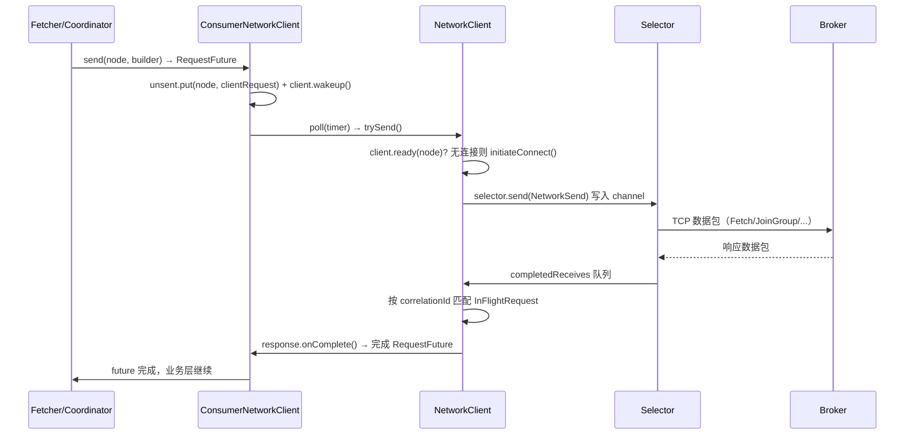
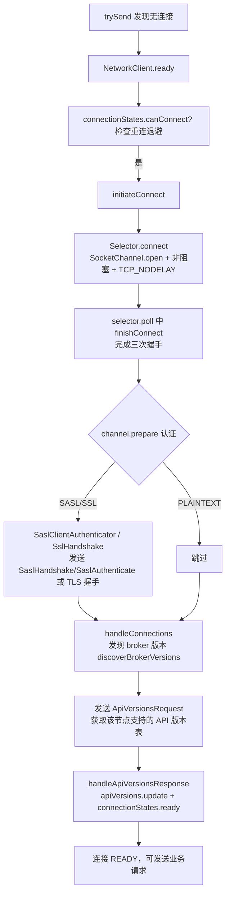
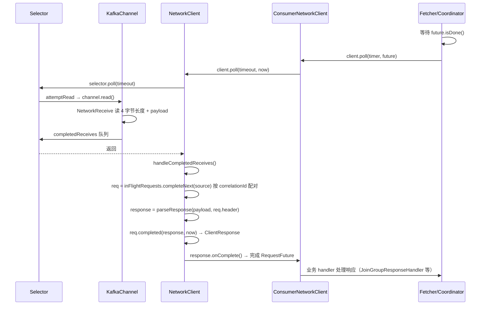
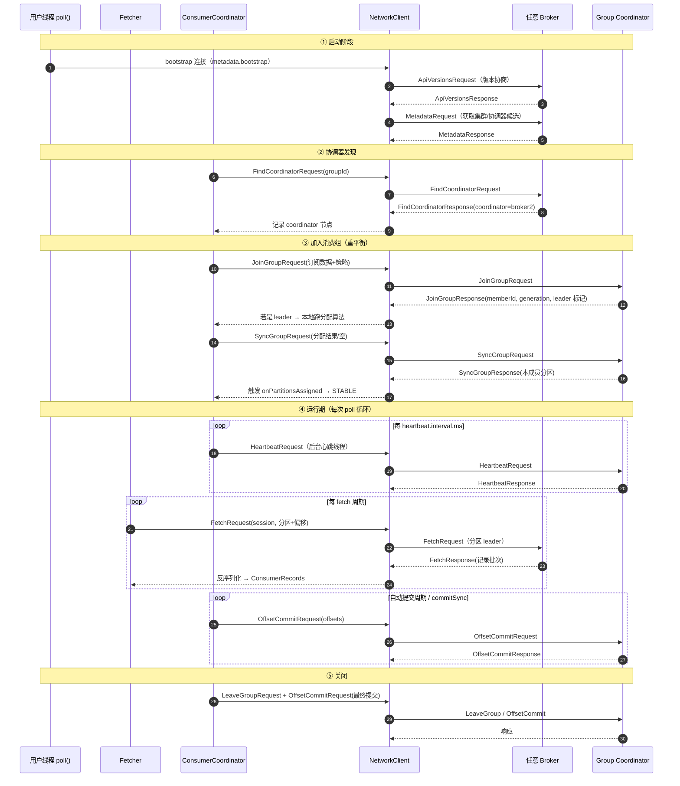
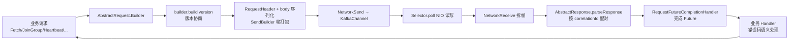

# Kafka 消费者与 Broker 通信机制源码深度分析

> 分析对象：`ClassicKafkaConsumer` 及其底层通信栈
> 涉及源码：
> - `clients/.../consumer/internals/ConsumerNetworkClient.java`（消费者网络客户端）
> - `clients/.../clients/NetworkClient.java`（通用网络客户端）
> - `clients/.../clients/ConsumerNetworkClient.java` 的底层 `KafkaClient`
> - `clients/.../common/network/Selector.java`（NIO 选择器）
> - `clients/.../common/network/KafkaChannel.java` / `NetworkSend.java` / `NetworkReceive.java`（通道与帧）
> - `clients/.../common/protocol/ApiKeys.java`（协议 API 定义）
> - `clients/.../common/requests/*.java`（各请求/响应结构）
> - `clients/.../consumer/internals/Fetcher.java`、`AbstractCoordinator.java`、`ConsumerCoordinator.java`（业务层）

---

## 目录

1. [总体架构：五层通信栈](#一总体架构五层通信栈)
2. [通信模型：异步发送 + 同步等待](#二通信模型异步发送--同步等待)
3. [发送一条请求的完整链路（代码级）](#三发送一条请求的完整链路代码级)
4. [TCP 连接建立与认证流程](#四tcp-连接建立与认证流程)
5. [响应接收与解析流程](#五响应接收与解析流程)
6. [Kafka 线协议（Wire Protocol）结构](#六kafka-线协议wire-protocol结构)
7. [消费者使用的全部 API 请求类型](#七消费者使用的全部-api-请求类型)
8. [各请求的协议字段结构](#八各请求的协议字段结构)
9. [消费者完整生命周期通信时序](#九消费者完整生命周期通信时序)
10. [心跳线程机制](#十心跳线程机制)
11. [超时、重试、断开与节流处理](#十一超时重试断开与节流处理)
12. [总结](#十二总结)

---

## 一、总体架构：五层通信栈

```mermaid
flowchart TB
    subgraph 应用层
        APP[用户代码 KafkaConsumer.poll()]
        CLASSIC[ClassicKafkaConsumer]
        COORD[ConsumerCoordinator / AbstractCoordinator]
        FETCHER[Fetcher]
    end
    subgraph 客户端网络层
        CNC[ConsumerNetworkClient<br/>请求队列·Future·心跳驱动]
        NC[NetworkClient<br/>连接管理·版本协商·InFlight 请求表]
    end
    subgraph NIO 传输层
        SEL[Selector<br/>java.nio Selector]
        CH[KafkaChannel<br/>SocketChannel + 认证/加密]
    end
    subgraph Broker 端
        BROKER[Broker SocketServer<br/>Processor→RequestChannel→KafkaApis]
    end

    APP --> CLASSIC --> COORD & FETCHER
    COORD & FETCHER --> CNC --> NC --> SEL --> CH -->|TCP Socket| BROKER
```

**各层职责：**

| 层次 | 类 | 职责 |
|---|---|---|
| 消费者逻辑层 | `ClassicKafkaConsumer` | 组装各组件，驱动 `poll()` 状态机 |
| 协调/拉取层 | `ConsumerCoordinator`、`AbstractCoordinator`、`Fetcher` | 构造 JoinGroup/SyncGroup/Heartbeat/Fetch 等请求，处理响应语义（错误码→重试/重平衡） |
| 消费者网络层 | `ConsumerNetworkClient` | 请求入队（`UnsentRequests`）、`RequestFuture` 异步回调模型、驱动 `NetworkClient.poll()`、心跳线程的网络入口 |
| 通用网络层 | `NetworkClient` | 连接状态机（`ClusterConnectionStates`）、API 版本协商、`InFlightRequests` 在途请求表、correlationId 配对、超时判定 |
| NIO 传输层 | `Selector` / `KafkaChannel` / `NetworkSend` / `NetworkReceive` | 非阻塞 socket I/O、SASL/SSL 认证与加解密、4 字节长度前缀帧读写 |

---

## 二、通信模型：异步发送 + 同步等待

Kafka 消费者使用 **"异步发送请求 + 在 `poll()` 中阻塞等待响应"** 的模型，与 `KafkaConsumer` 的"单线程驱动"设计一致：

1. **发送不阻塞**：调用 `send()` 只是把 `ClientRequest` 放入 `UnsentRequests` 队列（未真正上网络）；
2. **统一驱动 I/O**：真正收发发生在 `ConsumerNetworkClient.poll()` → `NetworkClient.poll()` → `Selector.poll()` 中；
3. **Future 配对**：每个请求关联一个 `RequestFutureCompletionHandler`，响应到达后由 `NetworkClient` 按 **correlationId** 找到对应的 `InFlightRequest`，完成其 `RequestFuture`；
4. **业务层等待**：`client.poll(future, timer)` 循环驱动 I/O 直到 `future.isDone()` 或超时。



---

## 三、发送一条请求的完整链路（代码级）

以消费者发送 `FetchRequest` 为例，共 **5 个阶段**：

### 阶段 1：请求构造与入队 — `ConsumerNetworkClient.send()`

```java
public RequestFuture<ClientResponse> send(Node node,
                                          AbstractRequest.Builder<?> requestBuilder,
                                          int requestTimeoutMs) {
    long now = time.milliseconds();
    RequestFutureCompletionHandler completionHandler = new RequestFutureCompletionHandler();
    ClientRequest clientRequest = client.newClientRequest(node.idString(), requestBuilder, now, true,
        requestTimeoutMs, completionHandler);
    unsent.put(node, clientRequest);   // ① 只入队，不上网络

    // ② 唤醒可能在 poll 中阻塞的线程，以便尽快把请求发出去
    client.wakeup();
    return completionHandler.future;
}
```

### 阶段 2：尝试发送 — `ConsumerNetworkClient.trySend()`

在每次 `poll()` 开头调用，**只有连接 ready 的节点才真正发送**：

```java
long trySend(long now) {
    long pollDelayMs = maxPollTimeoutMs;
    for (Node node : unsent.nodes()) {
        ...
        while (iterator.hasNext()) {
            ClientRequest request = iterator.next();
            if (client.ready(node, now)) {   // 连接就绪？
                client.send(request, now);   // 交给 NetworkClient
                iterator.remove();
            } else {
                break;   // 未就绪：等下次（同时会触发建连）
            }
        }
    }
    return pollDelayMs;
}
```

### 阶段 3：版本协商与序列化 — `NetworkClient.doSend()`

`NetworkClient` 在真正发送前要**确定协议版本**（依据 ApiVersions 握手缓存），然后序列化：

```java
private void doSend(ClientRequest clientRequest, boolean isInternalRequest, long now) {
    NodeApiVersions versionInfo = apiVersions.get(nodeId);   // 该节点的版本信息缓存
    short version;
    if (versionInfo == null) {
        version = builder.latestAllowedVersion();  // 无版本信息（ApiVersions 请求本身）
    } else {
        // 在 broker 支持范围内取客户端允许的最高版本
        version = versionInfo.latestUsableVersion(clientRequest.apiKey(),
                builder.oldestAllowedVersion(), builder.latestAllowedVersion());
    }
    doSend(clientRequest, isInternalRequest, now, builder.build(version));
}

private void doSend(ClientRequest clientRequest, boolean isInternalRequest, long now, AbstractRequest request) {
    RequestHeader header = clientRequest.makeHeader(request.version());  // ① 构造请求头
    Send send = request.toSend(header);                                  // ② 序列化：size + header + body
    InFlightRequest inFlightRequest = new InFlightRequest(clientRequest, header, isInternalRequest, request, send, now);
    this.inFlightRequests.add(inFlightRequest);                          // ③ 登记在途请求（correlationId 配对表）
    selector.send(new NetworkSend(clientRequest.destination(), send));   // ④ 交给 Selector 写入通道
}
```

### 阶段 4：NIO 写入 socket — `Selector.send()` + `poll()`

```java
public void send(NetworkSend send) {
    KafkaChannel channel = openOrClosingChannelOrFail(send.destinationId());
    channel.setSend(send);   // 挂到通道上，等 poll 时写
}
```

`Selector.poll(timeout)` 是 I/O 引擎核心：

```java
public void poll(long timeout) throws IOException {
    clear();
    ...
    int numReadyKeys = select(timeout);                    // java.nio Selector.select()
    if (numReadyKeys > 0 || ...) {
        pollSelectionKeys(readyKeys, false, endSelect);    // 处理每个就绪通道
    }
    ...
}
```

`pollSelectionKeys` 中对每个就绪通道依次执行：
1. `channel.finishConnect()` —— 完成 TCP 三次握手；
2. `channel.prepare()` —— 完成 SASL/SSL 认证握手（`transportLayer.ready() && authenticator.complete()`）；
3. `attemptRead(channel)` —— socket 可读则读数据；
4. `attemptWrite(key, channel, ...)` —— socket 可写且有 send 挂载则写数据。

> **关键点**：`SocketChannel` 以非阻塞模式（`configureBlocking(false)`）运行，并设置了 `TCP_NODELAY`（禁用 Nagle 算法，降低小请求延迟）。

### 阶段 5：请求发出后的记账 — `handleCompletedSends()`

```java
private void handleCompletedSends(List<ClientResponse> responses, long now) {
    for (NetworkSend send : this.selector.completedSends()) {
        InFlightRequest request = this.inFlightRequests.lastSent(send.destinationId());
        if (!request.expectResponse) {   // 不需要响应的请求（如 acks=0 的 Produce）到此即完成
            this.inFlightRequests.completeLastSent(send.destinationId());
            responses.add(request.completed(null, now));
        }
    }
}
```

消费者使用的所有请求都 `expectResponse=true`，故需等待响应。

---

## 四、TCP 连接建立与认证流程

消费者与每个 broker 的连接是**按需建立、长期复用**的（元数据返回的节点清单驱动建连）：



**代码依据：**

```java
// NetworkClient.initiateConnect
private void initiateConnect(Node node, long now) {
    connectionStates.connecting(nodeConnectionId, now, node.host());
    selector.connect(nodeConnectionId,
            new InetSocketAddress(address, node.port()),
            this.socketSendBuffer, this.socketReceiveBuffer);
}

// NetworkClient.handleConnections —— 新连接完成后的第一个动作：协商 API 版本
private void handleConnections() {
    for (String node : this.selector.connected()) {
        if (discoverBrokerVersions) {
            nodesNeedingApiVersionsFetch.put(node, new ApiVersionsRequest.Builder());
            log.debug("Completed connection to node {}. Fetching API versions.", node);
        } else {
            this.connectionStates.ready(node);
        }
    }
}

// KafkaChannel —— 通道就绪 = 传输层就绪 + 认证完成
public boolean ready() {
    return transportLayer.ready() && authenticator.complete();
}
```

> **为什么先发 ApiVersionsRequest？** Kafka 协议演进通过版本号管理，客户端必须知道 broker 支持哪些版本，才能选择"双方都支持的最高版本"来构造后续请求（见 `doSend` 中的 `latestUsableVersion`）。每次连接建立后、发送业务请求前，都强制走一次 ApiVersions 协商（除非 `discoverBrokerVersions=false`）。

---

## 五、响应接收与解析流程



**响应解析核心代码：**

```java
// NetworkClient.handleCompletedReceives
private void handleCompletedReceives(List<ClientResponse> responses, long now) {
    for (NetworkReceive receive : this.selector.completedReceives()) {
        String source = receive.source();
        InFlightRequest req = inFlightRequests.completeNext(source);  // 按发送顺序取出在途请求

        AbstractResponse response = parseResponse(receive.payload(), req.header);  // 反序列化
        maybeThrottle(response, req.header.apiVersion(), req.destination, now);    // 节流处理

        if (req.isInternalRequest && response instanceof MetadataResponse)
            metadataUpdater.handleSuccessfulResponse(...);     // 内部元数据请求
        else if (req.isInternalRequest && response instanceof ApiVersionsResponse)
            handleApiVersionsResponse(...);                    // 内部版本协商请求
        else
            responses.add(req.completed(response, now));       // 普通请求 → 回调完成
    }
}
```

**请求-响应配对的根本机制**：`RequestHeader` 中携带递增的 `correlationId`，broker 原样带回（响应头只含 correlationId），`InFlightRequests` 以"每连接先进先出"顺序配对（`completeNext(source)`），保证同连接上请求顺序与响应顺序一致。

---

## 六、Kafka 线协议（Wire Protocol）结构

### 6.1 请求帧（Request Frame）

`SendBuilder.buildRequestSend` 构造的字节流：

```java
private static Send buildSend(Message header, short headerVersion, Message apiMessage, short apiVersion) {
    ObjectSerializationCache serializationCache = new ObjectSerializationCache();
    MessageSizeAccumulator messageSize = new MessageSizeAccumulator();
    header.addSize(messageSize, serializationCache, headerVersion);
    apiMessage.addSize(messageSize, serializationCache, apiVersion);

    SendBuilder builder = new SendBuilder(messageSize.sizeExcludingZeroCopy() + 4);
    builder.writeInt(messageSize.totalSize());   // ① 4 字节：总长度（header+body）
    header.write(builder, serializationCache, headerVersion);   // ② 请求头
    apiMessage.write(builder, serializationCache, apiVersion);  // ③ 请求体
    return builder.build();
}
```

```
| 4 bytes (int32 BE) | RequestHeader                | Request Body              |
| 总长度 = hdr+body  | api_key | api_version | ...  | 各 API 特有的字段结构       |
```

**RequestHeader 结构**（`RequestHeaderData`，header version 由 api_key+api_version 决定）：

| 字段 | 类型 | 说明 |
|---|---|---|
| request_api_key | int16 | API 编号（见第七节 ApiKeys） |
| request_api_version | int16 | 请求版本 |
| correlation_id | int32 | 客户端递增的关联 ID |
| client_id | nullable string | 客户端标识（v1+ 必填，v0 可空） |
| tagged_fields | (varint 数量 + 条目) | **仅 flexible versions**（Kafka 2.4+ 新协议格式） |

### 6.2 响应帧（Response Frame）

| 字段 | 类型 | 说明 |
|---|---|---|
| correlation_id | int32 | 回显请求的 correlation_id，用于客户端配对 |
| tagged_fields | 变长 | 仅 flexible versions |
| Response Body | 各 API 特有 | 通常第一个字段是 `error_code`（int16），部分带 `throttle_time_ms` |

### 6.3 帧的边界与读取 — `NetworkReceive`

```java
/**
 * A size delimited Receive that consists of a 4 byte network-ordered size N followed by N bytes of content
 */
public class NetworkReceive implements Receive {
    private final ByteBuffer size;   // 4 字节
    private ByteBuffer buffer;       // 内容

    public long readFrom(ScatteringByteChannel channel) throws IOException {
        if (size.hasRemaining()) {
            int bytesRead = channel.read(size);       // 先读 4 字节长度
            if (!size.hasRemaining()) {
                int receiveSize = size.getInt();
                if (receiveSize < 0)
                    throw new InvalidReceiveException("Invalid receive (size = " + receiveSize + ")");
                if (maxSize != UNLIMITED && receiveSize > maxSize)
                    throw new InvalidReceiveException("Invalid receive (size = " + receiveSize +
                            " larger than " + maxSize + ")");
                ...
            }
        }
        ...
        channel.read(buffer);   // 再按长度读内容
    }
}
```

- 所有请求/响应都带 **4 字节大端长度前缀**，便于接收端按消息边界切片；
- 非阻塞模式下单次 `read` 可能只读到部分字节，`NetworkReceive` 维护"已读多少"的状态，跨多次 `poll()` 累积直到 `complete()`。

### 6.4 协议版本与 flexible versions

- 每个 API 都有自己的 `[min, max]` 版本区间，客户端通过 ApiVersions 握手获知 broker 支持区间；
- **flexible versions**（版本号 >= 某阈值）的消息格式采用变长整数（varint）编码，并支持 **tagged fields**（可扩展字段机制，向前兼容）；
- header version 与 body version 独立计算：`ApiKeys.requestHeaderVersion(apiVersion)`。

---

## 七、消费者使用的全部 API 请求类型

`ApiKeys.java` 中的枚举定义（客户端侧编号）：

| API | 编号 | 发送方 | 用途 | 发送时机 |
|---|---|---|---|---|
| `FETCH` | 1 | `Fetcher` | 拉取消息数据 | 每次 `poll()` 有可拉取分区时 |
| `LIST_OFFSETS` | 2 | `OffsetFetcher` | 查询指定时间戳/最早/最晚的偏移量 | 位置初始化（earliest/latest）、`offsetsForTimes`、`beginningOffsets` 等 |
| `METADATA` | 3 | `Metadata`（NetworkClient 内部） | 获取集群/topic 元数据（broker 列表、分区 leader） | 首次启动、定期刷新、新 topic 订阅 |
| `OFFSET_COMMIT` | 8 | `ConsumerCoordinator` | 提交消费偏移量 | `commitSync/commitAsync`、自动提交 |
| `OFFSET_FETCH` | 9 | `ConsumerCoordinator` | 读取已提交偏移量 | 重平衡后初始化位置 |
| `FIND_COORDINATOR` | 10 | `AbstractCoordinator` | 发现消费组协调器所在 broker | 首次加入组、协调器失联时 |
| `JOIN_GROUP` | 11 | `AbstractCoordinator` | 加入消费组（含订阅元数据） | 重平衡时 |
| `HEARTBEAT` | 12 | `AbstractCoordinator`（心跳线程） | 维持组成员活性 | 周期发送（`heartbeat.interval.ms`） |
| `LEAVE_GROUP` | 13 | `AbstractCoordinator` | 主动离开消费组 | `unsubscribe()`、`close()` |
| `SYNC_GROUP` | 14 | `AbstractCoordinator` | 同步组分配结果 | JoinGroup 之后 |
| `SASL_HANDSHAKE` / `SASL_AUTHENTICATE` | 16 / 17 | 认证层 | SASL 认证（可选） | 连接建立时 |
| `API_VERSIONS` | 18 | `NetworkClient`（内部） | 协商 API 版本 | 每次新连接建立时 |

> 消费者使用经典协议（`group.protocol=classic`）时，组管理走 `JOIN_GROUP`/`SYNC_GROUP`/`HEARTBEAT`/`LEAVE_GROUP`；使用新协议（KIP-848，`group.protocol=consumer`）时则由 `CONSUMER_GROUP_HEARTBEAT`(44) 一个请求承载全部组管理功能（`AsyncKafkaConsumer` 使用）。

---

## 八、各请求的协议字段结构

### 8.1 FetchRequest（编号 1）— 拉取数据

`Fetcher.prepareFetchRequests()` 按"每个 leader broker 一个请求"分组构造（通过 `FetchSessionHandler` 维护增量会话）：

| 字段 | 类型 | 说明 |
|---|---|---|
| replica_id | int32 | 消费者固定为 `-1`（`CONSUMER_REPLICA_ID`） |
| max_wait_ms | int32 | broker 最长等待时间（`fetch.max.wait.ms`） |
| min_bytes | int32 | 最少返回字节数（`fetch.min.bytes`） |
| max_bytes | int32 | 响应上限（`fetch.max.bytes`） |
| isolation_level | int8 | `READ_UNCOMMITTED`(0) / `READ_COMMITTED`(1) |
| session_id | int32 | 增量拉取会话 ID（首次为 0） |
| session_epoch | int32 | 会话代数（首次为 -1 表示全新会话） |
| topics[] | 数组 | 每个 topic：topic_id(UUID)、partitions[] |
| partitions[].partition | int32 | 分区号 |
| partitions[].current_leader_epoch | int32 | 当前 leader epoch（-1 表示未知） |
| partitions[].fetch_offset | int64 | 起始拉取偏移量 |
| partitions[].last_fetched_epoch | int32 | 上次拉取的 leader epoch |
| partitions[].log_start_offset | int64 | 分区日志起始偏移 |
| partitions[].partition_max_bytes | int32 | 单分区上限（`max.partition.fetch.bytes`） |

> **增量拉取会话（Incremental Fetch Session）**：KIP-227。首次发送全量 Fetch（epoch=-1），broker 返回 `session_id`；后续请求只需携带**变化的分区**（`toSend`/`toForget`），大幅降低请求体大小。会话在 `Fetcher.close()` 时发送 epoch=-1 的请求关闭。

### 8.2 ListOffsetsRequest（编号 2）— 位置查询

```java
// OffsetFetcher 构造示例
ListOffsetsRequest.Builder builder = new ListOffsetsRequest.Builder(
        new ListOffsetsRequestData()
            .setReplicaId(-1)
            .setIsolationLevel(isolationLevel.id())
            .setTopics(topics));   // 每个分区：partition / current_leader_epoch / timestamp / max_num_offsets
```

| 字段 | 说明 |
|---|---|
| replica_id | 消费者为 -1 |
| isolation_level | 与拉取一致 |
| topics[].partitions[].timestamp | -1=最早、-2=最晚、其他=按时间戳查（`offsetsForTimes`） |
| topics[].partitions[].max_num_offsets | 返回的偏移量个数 |

### 8.3 MetadataRequest（编号 3）— 元数据

`NetworkClient.DefaultMetadataUpdater.maybeUpdate()` 在每次 `NetworkClient.poll()` 时检查是否需要刷新，自动发送内部 `MetadataRequest`（topics 列表 + allow_auto_topic_creation），响应由 `metadataUpdater.handleSuccessfulResponse()` 直接更新 `ConsumerMetadata`。

### 8.4 OffsetCommitRequest（编号 8）— 提交偏移

```java
// ConsumerCoordinator.sendOffsetCommitRequest
OffsetCommitRequest.Builder builder = new OffsetCommitRequest.Builder(
        new OffsetCommitRequestData()
            .setGroupId(groupId)
            .setGenerationId(generation.generationId)   // 手动 assign 时为 -1
            .setMemberId(generation.memberId)
            .setGroupInstanceId(...)
            .setTopics(...));   // 每个分区：partition / offset / leader_epoch / committed_metadata
```

| 字段 | 说明 |
|---|---|
| group_id | 消费组 ID |
| generation_id | 组代数（防止提交过期代数） |
| member_id / group_instance_id | 成员标识 |
| topics[].partitions[].offset | 提交的偏移量 |
| topics[].partitions[].leader_epoch | 提交时的 leader epoch（用于截断检测） |
| topics[].partitions[].committed_metadata | 自定义元数据 |

### 8.5 OffsetFetchRequest（编号 9）— 读取已提交偏移

```java
// ConsumerCoordinator.sendOffsetFetchRequest
OffsetFetchRequest.Builder requestBuilder =
    new OffsetFetchRequest.Builder(this.rebalanceConfig.groupId, true,
            new ArrayList<>(partitions), throwOnFetchStableOffsetsUnsupported);
```

| 字段 | 说明 |
|---|---|
| group_id | 消费组 ID |
| topics[] | 要查询的分区（空 = 全部） |
| require_stable_offsets | 是否要求事务稳定的偏移（v2+） |

### 8.6 FindCoordinatorRequest（编号 10）— 协调器发现

```java
// AbstractCoordinator.sendFindCoordinatorRequest —— 发给任意一个已知 broker
FindCoordinatorRequestData data = new FindCoordinatorRequestData()
        .setKeyType(CoordinatorType.GROUP.id())   // 0 = 消费组
        .setKey(this.rebalanceConfig.groupId);    // 组名
```

响应返回该组的 coordinator broker 地址（v1+ 支持批量）；收到响应后 `ConsumerCoordinator` 记录 `coordinator` 节点，后续 JoinGroup 等请求全部发给它。

### 8.7 JoinGroupRequest（编号 11）— 加入组

```java
JoinGroupRequest.Builder requestBuilder = new JoinGroupRequest.Builder(
        new JoinGroupRequestData()
                .setGroupId(rebalanceConfig.groupId)
                .setSessionTimeoutMs(this.rebalanceConfig.sessionTimeoutMs)   // session.timeout.ms
                .setMemberId(this.generation.memberId)                        // 首次为 UNKNOWN_MEMBER_ID("")
                .setGroupInstanceId(this.rebalanceConfig.groupInstanceId.orElse(null))
                .setProtocolType(protocolType())                              // "consumer"
                .setProtocols(metadata())                                     // 分配策略 + 订阅序列化数据
                .setRebalanceTimeoutMs(this.rebalanceConfig.rebalanceTimeoutMs) // max.poll.interval.ms
                .setReason(JoinGroupRequest.maybeTruncateReason(this.rejoinReason)));
```

**关键语义**：
- `protocols` 携带消费者**所有可用分配策略**（如 Range/RoundRobin/Sticky）及其订阅数据（`ConsumerProtocol.serializeSubscription`：topics、ownedPartitions、rackId 等，用于 cooperative-sticky 增量重平衡）；
- 首次加入 `member_id=""`，broker 返回 `MEMBER_ID_REQUIRED` 错误并给出新 memberId，客户端重发；
- 请求超时被覆盖为 `max(rebalanceTimeoutMs + 5s, requestTimeoutMs)`（重平衡允许阻塞较长时间）；
- 响应中 `leader` 字段非空的成员成为 leader，负责在本地运行分配算法。

### 8.8 SyncGroupRequest（编号 14）— 同步分配结果

```java
// Leader：携带计算好的全员分配结果
SyncGroupRequestData().setGroupId(...).setMemberId(...)
        .setGenerationId(generation.generationId)
        .setProtocolName(generation.protocolName)
        .setAssignments(groupAssignmentList)   // leader 才有内容

// Follower：空 assignments
.setAssignments(Collections.emptyList())
```

响应 `assignment` 字段包含该成员分配到的分区（`ConsumerProtocol.deserializeAssignment`），收到后 `onJoinComplete` 触发 `onPartitionsAssigned` 回调并进入 `STABLE` 状态。

### 8.9 HeartbeatRequest（编号 12）— 心跳

```java
HeartbeatRequestData().setGroupId(groupId).setMemberId(memberId)
        .setGroupInstanceId(...).setGenerationId(generationId)
```

仅 4 个字段，极小请求；`REBALANCE_IN_PROGRESS` 错误码表示组正在重平衡，触发本地重新 join。

### 8.10 LeaveGroupRequest（编号 13）— 离开组

`unsubscribe()` / `close()` 时发送，携带 groupId + memberId（v3+ 支持批量 members），通知 broker 移除成员，避免等待会话超时。

---

## 九、消费者完整生命周期通信时序



**要点**：
- **Fetch 发往分区 leader**（每个 leader 一个连接一个请求），**组管理类请求（Join/Sync/Heartbeat/Commit）全部发往 group coordinator**；
- 消费者同一时间与多个 broker 保持连接：协调器 + 各分区 leader；
- Fetch 与 OffsetCommit 在 `poll()` 主线程驱动，Heartbeat 由独立后台线程驱动（见下一节）。

---

## 十、心跳线程机制

消费者是"单线程驱动"，但**心跳是个例外**——由独立的后台守护线程发送（`AbstractCoordinator.HeartbeatThread`，线程名 `kafka-coordinator-heartbeat-thread | <groupId>`）：

```java
private class HeartbeatThread extends KafkaThread implements AutoCloseable {
    public void run() {
        while (true) {
            synchronized (AbstractCoordinator.this) {
                if (closed) return;
                if (!enabled) { wait(); continue; }        // JoinGroup 前不心跳
                if (state.hasNotJoinedGroup() || hasFailed()) { disable(); continue; }

                client.pollNoWakeup();                     // ① 先驱动网络 I/O 收响应
                long now = time.milliseconds();

                if (coordinatorUnknown()) {
                    lookupCoordinator();                   // 协调器失联时尝试重发现
                    wait(rebalanceConfig.retryBackoffMs);
                } else if (heartbeat.sessionTimeoutExpired(now)) {
                    markCoordinatorUnknown("session timed out ...");   // 会话超时
                } else if (heartbeat.pollTimeoutExpired(now)) {
                    handlePollTimeoutExpiry();             // 超过 max.poll.interval.ms → 主动离组
                } else if (!heartbeat.shouldHeartbeat(now)) {
                    wait(rebalanceConfig.retryBackoffMs);
                } else {
                    heartbeat.sentHeartbeat(now);
                    sendHeartbeatRequest();                // ② 发送 HeartbeatRequest
                    ...
                }
            }
        }
    }
}
```

**设计意图**：`poll()` 可能因用户处理数据而长时间不调用，但组活性由 `session.timeout.ms` 约束。心跳线程保证：
1. 不依赖用户 `poll()` 也能维持组成员资格；
2. 主线程卡死超过 `max.poll.interval.ms` 时主动离组（`handlePollTimeoutExpiry`）；
3. 心跳线程的网络请求通过 `ConsumerNetworkClient` 与主线程**共享同一个 NetworkClient**（`pollNoWakeup` 轻量驱动），避免了双连接。

---

## 十一、超时、重试、断开与节流处理

### 11.1 请求超时 — `NetworkClient.handleTimedOutRequests`

```java
private void handleTimedOutRequests(List<ClientResponse> responses, long now) {
    List<String> nodeIds = this.inFlightRequests.nodesWithTimedOutRequests(now);  // 超过 request.timeout.ms
    for (String nodeId : nodeIds) {
        this.selector.close(nodeId);                 // ① 关闭该连接
        processTimeoutDisconnection(responses, nodeId, now);  // ② 取消该连接所有在途请求 → DisconnectException
    }
}
```

- 超时策略：**关闭整个连接 + 取消全部在途请求**（简单粗暴，避免协议状态错乱）；
- 消费者层收到 `DisconnectException` 后按请求类型处理：可重试请求退避重发（`retryBackoffMs`），组管理请求触发"重新发现协调器"。

### 11.2 连接断开 — `processDisconnection`

```java
connectionStates.disconnected(nodeId, now);          // 进入断开状态，启动重连退避
apiVersions.remove(nodeId);                          // 清除版本缓存（重连后重新协商）
cancelInFlightRequests(nodeId, now, responses, timedOut);  // 在途请求全部失败
metadataUpdater.handleServerDisconnect(now, nodeId, ...);  // 通知元数据层
```

### 11.3 重试退避 — `ClusterConnectionStates`

- 连接失败/断开后按 **指数退避**（`retryBackoffMs` 起步，上限 `retryBackoffMaxMs`）才能再次建连（`canConnect` 检查）；
- 请求层重试：`ConsumerCoordinator.ensureCoordinatorReady` 中对 FindCoordinator 失败 `timer.sleep(retryBackoff.backoff(attempts++))`。

### 11.4 服务端节流 — `maybeThrottle`

```java
private void maybeThrottle(AbstractResponse response, short apiVersion, String nodeId, long now) {
    int throttleTimeMs = response.throttleTimeMs();
    if (throttleTimeMs > 0 && response.shouldClientThrottle(apiVersion)) {
        connectionStates.throttle(nodeId, now + throttleTimeMs);   // 该连接在节流期内不可发送
    }
}
```

broker 超配额时在响应中返回 `throttle_time_ms`，客户端对该连接暂停发送。

### 11.5 消费者层超时链

| 超时配置 | 作用对象 | 处理 |
|---|---|---|
| `request.timeout.ms` | 单个请求 | NetworkClient 超时断连 |
| `default.api.timeout.ms` | `commitSync`/`position` 等 API | 业务层 `Timer` 到期抛 `TimeoutException` |
| `session.timeout.ms` | 组成员活性 | 心跳超时 → 被踢出组 |
| `max.poll.interval.ms` | poll 间隔 | 心跳线程检测到超时 → 主动离组 |
| `fetch.max.wait.ms` | Fetch 请求 | broker 端最长等待（不超时，只是响应延迟） |

---

## 十二、总结



**核心结论：**

1. **一套网络栈，两类请求**：消费者的所有 broker 交互（元数据、组管理、拉取、偏移提交）都经由 `ConsumerNetworkClient → NetworkClient → Selector` 同一套栈，靠 `RequestFuture` 回调分发；
2. **异步发送、poll 驱动**：请求只入队不阻塞，I/O 全部由 `poll()` 循环推进（心跳线程例外），响应按 correlationId 精确配对；
3. **连接复用 + 版本协商**：每个 broker 一条长期 TCP 连接，每次建连先 ApiVersions 握手，再按双方最高兼容版本通信；
4. **协议简单而精巧**：4 字节长度前缀 + (api_key, api_version, correlation_id) 头 + 版本化 body，flexible versions 引入 tagged fields 保证前后兼容；
5. **可靠性由多级机制兜底**：请求超时断连、指数退避重连、心跳保活、断开时在途请求全部失败并触发业务层重试/重平衡。
