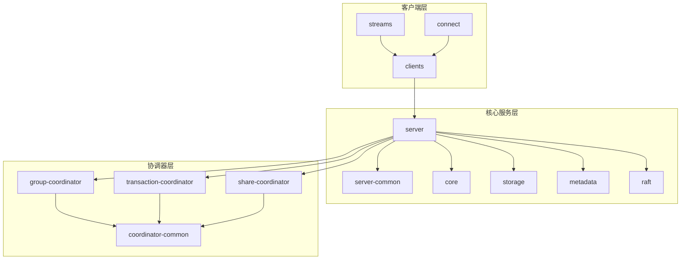
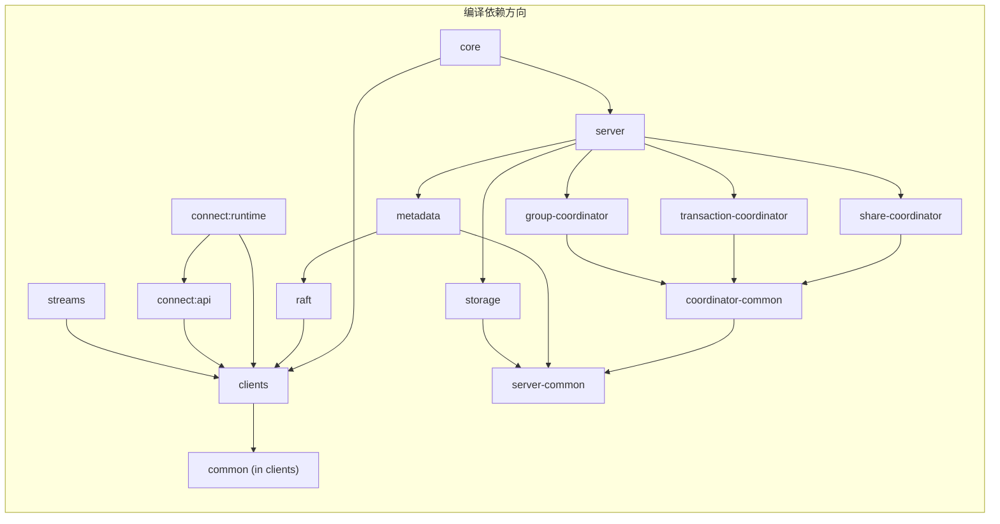

# Apache Kafka 项目工程结构详细分析

## 一、项目总览

Apache Kafka 是一个高性能分布式消息流处理平台，采用 **Gradle** 多模块构建系统。项目根目录包含 **36+ 子目录**和 **17 个顶层文件**，在 [settings.gradle](file:///c:/Users/Administrator/kafka/settings.gradle) 中注册了 **60+ 个 Gradle 子项目**。

### 架构层次图



---

## 二、顶层文件说明

| 文件 | 作用 |
|------|------|
| [build.gradle](file:///c:/Users/Administrator/kafka/build.gradle) | 主构建脚本（138KB），定义所有子项目的编译配置、依赖管理、测试规则、打包发布等 |
| [settings.gradle](file:///c:/Users/Administrator/kafka/settings.gradle) | Gradle 多项目设置，注册所有子模块（60+），配置 Develocity 构建扫描和缓存 |
| [gradle.properties](file:///c:/Users/Administrator/kafka/gradle.properties) | Gradle 全局属性如版本号、JVM 参数、并行构建配置 |
| [gradlew](file:///c:/Users/Administrator/kafka/gradlew) | Gradle Wrapper 启动脚本（Unix），确保构建环境一致性 |
| [gradlewAll](file:///c:/Users/Administrator/kafka/gradlewAll) | 包装脚本，可一次性运行多个 Gradle 命令 |
| [wrapper.gradle](file:///c:/Users/Administrator/kafka/wrapper.gradle) | Gradle Wrapper 版本和配置管理 |
| `build/` | Gradle 构建输出目录（编译产物、报告等） |
| [README.md](file:///c:/Users/Administrator/kafka/README.md) | 项目介绍、快速入门、构建指南 |
| [CONTRIBUTING.md](file:///c:/Users/Administrator/kafka/CONTRIBUTING.md) | 贡献者指南 |
| [LICENSE](file:///c:/Users/Administrator/kafka/LICENSE) | Apache License 2.0 主许可证 |
| [LICENSE-binary](file:///c:/Users/Administrator/kafka/LICENSE-binary) | 二进制分发包的综合许可证信息 |
| [NOTICE](file:///c:/Users/Administrator/kafka/NOTICE) | Apache 版权声明 |
| [NOTICE-binary](file:///c:/Users/Administrator/kafka/NOTICE-binary) | 二进制分发包的第三方软件声明 |
| [HEADER](file:///c:/Users/Administrator/kafka/HEADER) | 源代码文件统一的许可证头模板 |
| [Vagrantfile](file:///c:/Users/Administrator/kafka/Vagrantfile) | Vagrant 虚拟机配置，用于创建可重复的开发/测试环境 |
| [.asf.yaml](file:///c:/Users/Administrator/kafka/.asf.yaml) | Apache Software Foundation 基础设施自动化配置 |
| [.gitignore](file:///c:/Users/Administrator/kafka/.gitignore) | Git 忽略规则 |
| [doap_Kafka.rdf](file:///c:/Users/Administrator/kafka/doap_Kafka.rdf) | DOAP（Description of a Project）元数据文件 |

---

## 三、核心业务模块

### 3.1 `clients/` — 客户端库

Kafka 客户端核心库，提供 Producer、Consumer、Admin 等 API。

```
clients/
├── src/main/java/org/apache/kafka/
│   ├── clients/           # 客户端通用基础设施
│   │   ├── consumer/      # KafkaConsumer 实现
│   │   ├── producer/      # KafkaProducer 实现
│   │   ├── admin/         # KafkaAdminClient 实现
│   │   └── ...            # 网络层、认证、元数据等
│   ├── common/            # 跨模块共享类
│   │   ├── config/        # 配置定义与解析
│   │   ├── errors/        # 异常与错误码定义
│   │   ├── header/        # 消息头（Record Header）
│   │   ├── metrics/       # 指标采集框架
│   │   ├── network/       # 网络传输层
│   │   ├── protocol/      # Kafka 二进制协议编解码
│   │   ├── record/        # 消息记录（Record/RecordBatch）
│   │   ├── requests/      # API 请求/响应定义
│   │   ├── security/      # 安全、认证（SASL/SSL）
│   │   ├── serialization/ # 序列化/反序列化器
│   │   └── utils/         # 通用工具类
│   └── server/            # 服务端共享接口（authorizer 等）
├── clients-integration-tests/  # 客户端集成测试
└── src/test/                   # 单元测试
```

**核心职责**：
- `KafkaProducer`：消息发送，含分区路由、批量发送、重试、幂等性
- `KafkaConsumer`：消息消费，含消费组协调、偏移量管理、再均衡
- `KafkaAdminClient`：集群管理操作（创建Topic、配置管理等）
- `common/protocol/`：Kafka RPC 协议的完整编解码实现

---

### 3.2 `core/` — Broker 核心（Scala）

传统的 Kafka Broker 核心实现，使用 **Scala** 编写。

```
core/src/main/
├── java/kafka/
│   ├── docker/            # Docker 环境下的配置与启动支持
│   └── server/            # 服务端 Java 补充实现
└── scala/kafka/
    ├── admin/             # 管理操作工具（副本重分配等）
    ├── cluster/           # 集群状态管理
    ├── coordinator/       # 消费组/事务协调器（旧实现）
    ├── docker/            # Docker 相关 Scala 工具
    ├── log/               # 日志子系统（LogSegment、LogManager）
    ├── metrics/           # Broker 级指标收集
    ├── network/           # Socket 网络层（SocketServer、RequestChannel）
    ├── raft/              # Raft 协议与 KRaft 模式集成
    ├── server/            # Broker 主入口（KafkaServer、KafkaConfig）
    ├── tools/             # 内置命令行工具类
    └── utils/             # Scala 工具类
```

**核心职责**：
- Broker 启动/停止生命周期管理
- 请求处理管线（RequestHandler → KafkaApis）
- 日志管理（Log Segment 滚动、清理、压缩）
- 控制器选举与状态机（旧 ZooKeeper 模式）

---

### 3.3 `server/` — 服务端新实现（Java）

用 Java 重写的 Broker 服务端模块，逐步替代 `core/` 中的 Scala 代码。

```
server/src/main/java/org/apache/kafka/
├── network/               # 新版网络处理层
├── security/              # 安全机制新实现
└── server/                # 服务端核心逻辑
    ├── handlers/          # API 请求处理器
    ├── share/             # 共享消费（Share Group）实现
    └── ...
```

---

### 3.4 `server-common/` — 服务端公共组件

服务端模块间共享的公共代码库。

**核心内容**：
- 通用服务端接口和抽象类
- 配置管理工具
- 日志相关的通用实现
- 特性标志（Feature Flag）管理

---

### 3.5 `storage/` — 存储引擎

消息持久化存储的核心实现。

```
storage/
├── api/                   # 存储层 API 接口定义(独立子模块: storage-api)
└── src/main/java/org/apache/kafka/
    ├── server/            # 与 server 集成的存储组件
    │   └── log/           # 日志存储核心实现
    │       ├── internals/ # 内部实现（索引、段文件管理）
    │       └── remote/    # 远程存储（分层存储）支持
    └── storage/           # 存储层自身抽象
```

**核心职责**：
- Log Segment 管理（创建、滚动、删除）
- 索引文件管理（偏移量索引、时间索引、事务索引）
- 日志压缩（Log Compaction）
- 分层存储（Tiered Storage / Remote Storage）

---

### 3.6 `metadata/` — 元数据管理

KRaft 模式下的集群元数据管理模块。

```
metadata/src/main/java/org/apache/kafka/
├── common/                # 元数据公共类
├── controller/            # KRaft Controller 实现
│   ├── es/                # Event Sourcing 模式
│   └── ...                # 分区分配、副本管理等
├── image/                 # 元数据镜像（Metadata Image/Snapshot）
└── metadata/              # 元数据记录定义与序列化
```

**核心职责**：
- KRaft Controller：基于 Raft 日志的集群元数据管理
- Metadata Image：集群元数据的内存快照
- Topic/Partition/Broker 元数据变更事件处理

---

### 3.7 `raft/` — Raft 共识协议实现

KRaft 模式的底层 Raft 共识协议库。

```
raft/
├── bin/                   # Raft 相关工具脚本
├── config/                # Raft 配置示例
└── src/main/java/org/apache/kafka/
    ├── raft/              # Raft 核心算法
    │   ├── internals/     # 内部状态机、选举、日志复制
    │   └── ...
    └── snapshot/          # Raft 快照机制
```

**核心职责**：
- 领导者选举（Leader Election）
- 日志复制（Log Replication）
- 快照生成与恢复
- 成员变更管理

---

## 四、协调器模块

### 4.1 `coordinator-common/` — 协调器公共框架

所有协调器（Group、Transaction、Share）共享的基础框架。

**核心内容**：
- 协调器通用接口定义
- 状态机抽象
- Timer 管理

---

### 4.2 `group-coordinator/` — 消费组协调器

管理消费组（Consumer Group）的生命周期。

```
group-coordinator/
├── group-coordinator-api/   # 组协调器 API 接口子模块
└── src/                     # 核心实现
```

**核心职责**：
- 消费组成员管理与再均衡（Rebalance）
- 偏移量提交与查询
- 消费组状态机（Empty → PreparingRebalance → CompletingRebalance → Stable）
- 新版 Consumer Protocol 支持

---

### 4.3 `transaction-coordinator/` — 事务协调器

管理 Kafka 事务的全生命周期。

**核心职责**：
- 事务 ID 到协调器的映射
- 两阶段提交（2PC）事务流程
- 事务状态持久化
- 幂等性 Producer ID 管理

---

### 4.4 `share-coordinator/` — 共享消费协调器

管理 Share Group（共享消费组）—— Kafka 的新消费模式。

**核心职责**：
- 共享消费（多消费者竞争消费同一分区）状态管理
- 消息确认与重试机制

---

## 五、Kafka Connect 模块

### 5.1 `connect/` — 数据集成框架

Kafka Connect 是内置的数据集成框架，用于在 Kafka 与外部系统间流式传输数据。

```
connect/
├── api/                   # Connect API 接口定义
│   └── Connector, Task, Converter, Transform 等核心接口
├── runtime/               # Connect 运行时引擎
│   └── Worker, Herder, 分布式协调等
├── json/                  # JSON Converter 实现
├── file/                  # 文件 Source/Sink Connector（示例）
├── basic-auth-extension/  # HTTP Basic Auth 扩展
├── mirror/                # MirrorMaker 2（跨集群复制）
├── mirror-client/         # MirrorMaker 客户端库
├── transforms/            # 内置 SMT（Single Message Transform）
└── test-plugins/          # 测试用插件
```

#### 各子模块详细说明

| 子模块 | 作用 |
|--------|------|
| `api/` | Connector、Task、Converter、Transform、HeaderConverter 等核心接口 |
| `runtime/` | Connect 运行框架：Worker 线程管理、任务调度、配置管理、REST API、分布式协调 |
| [json/](file:///c:/Users/Administrator/kafka/gradle/LICENSE.json) | JsonConverter 和 JsonSchema，用于 JSON 格式的数据序列化 |
| [file/](file:///c:/Users/Administrator/kafka/Vagrantfile) | FileStreamSourceConnector 和 FileStreamSinkConnector 示例实现 |
| `basic-auth-extension/` | 为 Connect REST API 提供 HTTP Basic Auth 安全扩展 |
| `mirror/` | MirrorMaker 2 核心实现（MirrorSourceConnector、MirrorCheckpointConnector、MirrorHeartbeatConnector） |
| `mirror-client/` | 供应用程序使用的 MirrorMaker 客户端，用于远程 Topic 发现和偏移量转换 |
| `transforms/` | 内置消息转换器（Cast、Flatten、InsertField、MaskField、ReplaceField、TimestampConverter 等） |
| `test-plugins/` | 用于 Connect 框架自身测试的假插件 |

---

## 六、Kafka Streams 模块

### 6.1 `streams/` — 流处理引擎

Kafka Streams 是构建在 Kafka 客户端之上的流处理库。

```
streams/
├── src/                   # 核心实现
│   └── main/java/org/apache/kafka/streams/
│       ├── kstream/       # KStream/KTable DSL API
│       ├── processor/     # Processor API（底层 API）
│       ├── state/         # 状态存储（State Store）
│       └── ...
├── streams-scala/         # Scala DSL 包装
├── test-utils/            # 测试工具（TopologyTestDriver）
├── examples/              # 示例应用
├── integration-tests/     # 集成测试
├── quickstart/            # 快速入门模板
└── upgrade-system-tests-*/ # 各版本升级兼容性测试（0110~41）
```

**核心职责**：
- KStream / KTable / GlobalKTable DSL
- Processor API（自定义处理拓扑）
- 状态存储（RocksDB、InMemory）
- Windows（滑动窗口、跳跃窗口、会话窗口）
- 精确一次语义（Exactly-once Semantics）

---

## 七、命令行工具与脚本

### 7.1 `bin/` — Shell 启动脚本

包含 43 个 Shell 脚本，用于启动各种 Kafka 工具和服务。

| 脚本分类 | 脚本列表 | 说明 |
|----------|----------|------|
| **服务启停** | [kafka-server-start.sh](file:///c:/Users/Administrator/kafka/bin/kafka-server-start.sh), [kafka-server-stop.sh](file:///c:/Users/Administrator/kafka/bin/kafka-server-stop.sh) | 启停 Broker |
| **Topic 管理** | [kafka-topics.sh](file:///c:/Users/Administrator/kafka/bin/kafka-topics.sh) | 创建/列出/删除/描述 Topic |
| **消息收发** | [kafka-console-producer.sh](file:///c:/Users/Administrator/kafka/bin/kafka-console-producer.sh), [kafka-console-consumer.sh](file:///c:/Users/Administrator/kafka/bin/kafka-console-consumer.sh), [kafka-console-share-consumer.sh](file:///c:/Users/Administrator/kafka/bin/kafka-console-share-consumer.sh) | 命令行消息生产/消费 |
| **消费组管理** | [kafka-consumer-groups.sh](file:///c:/Users/Administrator/kafka/bin/kafka-consumer-groups.sh), [kafka-groups.sh](file:///c:/Users/Administrator/kafka/bin/kafka-groups.sh), [kafka-share-groups.sh](file:///c:/Users/Administrator/kafka/bin/kafka-share-groups.sh), [kafka-streams-groups.sh](file:///c:/Users/Administrator/kafka/bin/kafka-streams-groups.sh) | 消费组状态查看与管理 |
| **性能测试** | [kafka-producer-perf-test.sh](file:///c:/Users/Administrator/kafka/bin/kafka-producer-perf-test.sh), [kafka-consumer-perf-test.sh](file:///c:/Users/Administrator/kafka/bin/kafka-consumer-perf-test.sh), [kafka-share-consumer-perf-test.sh](file:///c:/Users/Administrator/kafka/bin/kafka-share-consumer-perf-test.sh), [kafka-e2e-latency.sh](file:///c:/Users/Administrator/kafka/bin/kafka-e2e-latency.sh) | 吞吐量与延迟测试 |
| **集群运维** | [kafka-configs.sh](file:///c:/Users/Administrator/kafka/bin/kafka-configs.sh), [kafka-log-dirs.sh](file:///c:/Users/Administrator/kafka/bin/kafka-log-dirs.sh), [kafka-reassign-partitions.sh](file:///c:/Users/Administrator/kafka/bin/kafka-reassign-partitions.sh), [kafka-leader-election.sh](file:///c:/Users/Administrator/kafka/bin/kafka-leader-election.sh), [kafka-replica-verification.sh](file:///c:/Users/Administrator/kafka/bin/kafka-replica-verification.sh) | 配置管理与分区运维 |
| **安全管理** | [kafka-acls.sh](file:///c:/Users/Administrator/kafka/bin/kafka-acls.sh), [kafka-delegation-tokens.sh](file:///c:/Users/Administrator/kafka/bin/kafka-delegation-tokens.sh) | ACL 和 Token 管理 |
| **KRaft** | [kafka-metadata-quorum.sh](file:///c:/Users/Administrator/kafka/bin/kafka-metadata-quorum.sh), [kafka-metadata-shell.sh](file:///c:/Users/Administrator/kafka/bin/kafka-metadata-shell.sh), [kafka-storage.sh](file:///c:/Users/Administrator/kafka/bin/kafka-storage.sh), [kafka-features.sh](file:///c:/Users/Administrator/kafka/bin/kafka-features.sh) | KRaft 元数据管理 |
| **Connect** | [connect-distributed.sh](file:///c:/Users/Administrator/kafka/bin/connect-distributed.sh), [connect-standalone.sh](file:///c:/Users/Administrator/kafka/bin/connect-standalone.sh), [connect-mirror-maker.sh](file:///c:/Users/Administrator/kafka/bin/connect-mirror-maker.sh), [connect-plugin-path.sh](file:///c:/Users/Administrator/kafka/bin/connect-plugin-path.sh) | Kafka Connect 启动 |
| **其他工具** | [kafka-dump-log.sh](file:///c:/Users/Administrator/kafka/bin/kafka-dump-log.sh), [kafka-delete-records.sh](file:///c:/Users/Administrator/kafka/bin/kafka-delete-records.sh), [kafka-get-offsets.sh](file:///c:/Users/Administrator/kafka/bin/kafka-get-offsets.sh), [kafka-transactions.sh](file:///c:/Users/Administrator/kafka/bin/kafka-transactions.sh), [kafka-jmx.sh](file:///c:/Users/Administrator/kafka/bin/kafka-jmx.sh), [kafka-broker-api-versions.sh](file:///c:/Users/Administrator/kafka/bin/kafka-broker-api-versions.sh), [kafka-client-metrics.sh](file:///c:/Users/Administrator/kafka/bin/kafka-client-metrics.sh), [kafka-cluster.sh](file:///c:/Users/Administrator/kafka/bin/kafka-cluster.sh), [kafka-streams-application-reset.sh](file:///c:/Users/Administrator/kafka/bin/kafka-streams-application-reset.sh) | 日志转储、偏移量查询等 |
| **验证工具** | [kafka-verifiable-producer.sh](file:///c:/Users/Administrator/kafka/bin/kafka-verifiable-producer.sh), [kafka-verifiable-consumer.sh](file:///c:/Users/Administrator/kafka/bin/kafka-verifiable-consumer.sh), [kafka-verifiable-share-consumer.sh](file:///c:/Users/Administrator/kafka/bin/kafka-verifiable-share-consumer.sh) | 端到端验证 |
| **基础脚本** | [kafka-run-class.sh](file:///c:/Users/Administrator/kafka/bin/kafka-run-class.sh) | 底层类加载和 JVM 启动脚本（所有脚本的入口） |
| **Trogdor** | [trogdor.sh](file:///c:/Users/Administrator/kafka/bin/trogdor.sh) | 分布式故障注入测试框架脚本 |

`bin/windows/` 目录包含对应的 `.bat` Windows 版本脚本。

---

### 7.2 `tools/` — 命令行工具实现

以上 Shell 脚本背后的 Java 实现代码。

```
tools/
├── src/                   # 工具 Java 源码
├── tools-api/             # 工具 API 子模块（插件接口）
└── build/
```

---

### 7.3 `shell/` — Metadata Shell

交互式元数据 Shell，用于查看和分析 KRaft 集群的元数据快照。

---

## 八、配置目录

### 8.1 `config/` — 配置模板文件

| 文件 | 作用 |
|------|------|
| `server.properties` | 同时运行 Broker + Controller 的混合模式配置 |
| `broker.properties` | 纯 Broker 角色配置（KRaft 模式） |
| `controller.properties` | 纯 Controller 角色配置（KRaft 模式） |
| `producer.properties` | Producer 客户端配置模板 |
| `consumer.properties` | Consumer 客户端配置模板 |
| `connect-distributed.properties` | Connect 分布式模式配置 |
| `connect-standalone.properties` | Connect 单机模式配置 |
| `connect-console-source.properties` | Console Source Connector 配置 |
| `connect-console-sink.properties` | Console Sink Connector 配置 |
| `connect-file-source.properties` | File Source Connector 配置 |
| `connect-file-sink.properties` | File Sink Connector 配置 |
| `connect-mirror-maker.properties` | MirrorMaker 2 配置 |
| `log4j2.yaml` | 服务端日志配置（Log4j2 YAML 格式） |
| `connect-log4j2.yaml` | Connect 的日志配置 |
| `tools-log4j2.yaml` | 命令行工具日志配置 |
| `trogdor.conf` | Trogdor 测试框架配置 |

---

## 九、测试与质量保障

### 9.1 `tests/` — 系统集成测试（Python）

基于 **Ducktape** 框架的端到端系统测试。

```
tests/
├── kafkatest/             # Python 测试代码
│   ├── services/          # Kafka 服务定义（Broker、ZK、Connect 等）
│   ├── tests/             # 测试用例（生产消费、复制、升级等）
│   └── ...
├── spec/                  # 测试规范
├── unit/                  # Python 单元测试
├── docker/                # 测试环境 Docker 配置
├── setup.py               # Python 包安装脚本
└── bootstrap-test-env.sh  # 测试环境引导脚本
```

---

### 9.2 `test-common/` — 共享测试基础设施

```
test-common/
├── test-common-internal-api/  # 内部测试 API
├── test-common-runtime/       # 测试运行时（如嵌入式 Kafka 集群）
└── test-common-util/          # 测试工具类
```

---

### 9.3 `jmh-benchmarks/` — JMH 性能基准测试

使用 JMH（Java Microbenchmark Harness）框架对关键代码路径进行微基准测试。

- 消息序列化/反序列化性能
- 压缩算法对比
- 请求处理吞吐量
- 状态存储读写性能

---

### 9.4 `trogdor/` — 分布式故障注入框架

Trogdor 是 Kafka 自研的分布式测试框架，用于：
- 网络故障注入（延迟、丢包、分区）
- 磁盘故障模拟
- 高负载压力测试
- 集群稳定性验证

---

### 9.5 `checkstyle/` — 代码风格检查

| 文件 | 作用 |
|------|------|
| `checkstyle.xml` | 主 Checkstyle 规则配置 |
| `.scalafmt.conf` | Scala 代码格式化配置 |
| `java.header` | Java 文件许可证头模板 |
| `suppressions.xml` | Checkstyle 规则豁免配置 |
| `import-control.xml` | 全局模块间 import 控制（防止依赖循环/违规） |
| `import-control-*.xml` | 各子模块独立的 import 控制规则（共 15+ 个） |

---

## 十、构建与发布基础设施

### 10.1 `gradle/` — Gradle 构建支持

| 文件/目录 | 作用 |
|-----------|------|
| `dependencies.gradle` | 集中管理所有第三方依赖版本定义 |
| `wrapper/` | Gradle Wrapper JAR 和配置 |
| `spotbugs-exclude.xml` | SpotBugs 静态分析排除规则 |
| `openapi.template` | OpenAPI 文档生成模板 |
| `LICENSE.json` | 许可证元数据 |
| `resources/` | 构建资源文件 |

---

### 10.2 `docker/` — Docker 镜像构建

| 文件/目录 | 作用 |
|-----------|------|
| `jvm/` | 基于 JVM 的 Docker 镜像构建文件（Dockerfile） |
| `native/` | GraalVM Native Image 构建文件 |
| `docker_official_images/` | Docker Hub 官方镜像提交材料 |
| `examples/` | Docker Compose 使用示例 |
| `test/` | Docker 镜像测试 |
| `resources/` | 镜像内使用的资源文件 |
| `common.py` | Docker 构建公共 Python 工具 |
| `docker_build_test.py` | 自动化构建测试脚本 |
| `docker_release.py` | Docker 镜像发布脚本 |
| `server.properties` | Docker 镜像内的默认服务配置 |
| `requirements.txt` | Python 依赖 |

---

### 10.3 `release/` — 发布自动化工具

发布 Kafka 版本所需的自动化 Python 脚本集。

| 文件 | 作用 |
|------|------|
| `release.py` | 主发布脚本（版本构建、签名、上传） |
| `git.py` | Git 操作封装（Tag、Branch） |
| `gpg.py` | GPG 签名工具 |
| `svn.py` | SVN 操作（Apache dist 仓库） |
| `notes.py` | 发布说明生成 |
| `templates.py` | 发布投票邮件等模板 |
| `preferences.py` | 用户偏好配置 |
| `runtime.py` | 运行时环境工具 |
| `textfiles.py` | 文本文件处理 |

---

### 10.4 `committer-tools/` — 提交者工具

ASF 提交者和 PMC 成员使用的开发管理工具。

| 文件 | 作用 |
|------|------|
| `kafka-merge-pr.py` | GitHub PR 合并脚本（含 JIRA 集成） |
| `reviewers.py` | PR 审查者管理 |
| `refresh_collaborators.py` | GitHub 协作者列表同步 |
| `find-unfinished-test.py` | 查找未完成/跳过的测试用例 |
| `verify_license.py` | 许可证合规性验证 |
| `update-cache.sh` | 缓存更新脚本 |

---

### 10.5 `.github/` — GitHub 自动化

```
.github/
├── workflows/             # GitHub Actions CI/CD 工作流定义
├── actions/               # 自定义 GitHub Actions
├── scripts/               # CI 辅助脚本
├── configs/               # CI 配置文件
└── pull_request_template.md  # PR 模板
```

---

## 十一、其他辅助模块

### 11.1 `generator/` — 协议代码生成器

根据 Kafka 协议的 JSON Schema 定义，自动生成 API 请求/响应的 Java 编解码代码。确保协议实现与规范保持一致。

---

### 11.2 `examples/` — 示例代码

提供使用 Kafka Producer/Consumer/Streams API 的 Java 示例代码，帮助开发者快速上手。

---

### 11.3 `docs/` — 官方文档

```
docs/
├── _index.md              # 文档首页
├── apis/                  # API 文档
├── configuration/         # 配置参数文档
├── design/                # 设计文档
├── documentation/         # 综合文档
├── getting-started/       # 入门指南
├── implementation/        # 实现细节
├── operations/            # 运维手册
├── security/              # 安全指南
├── kafka-connect/         # Kafka Connect 文档
├── streams/               # Kafka Streams 文档
├── images/                # 文档图片
└── generated/             # 自动生成的文档内容
```

---

### 11.4 `licenses/` — 第三方许可证

存储所有第三方依赖库的完整许可证文本（BSD、MIT、CDDL、EPL 等）。

---

### 11.5 `vagrant/` — 虚拟环境管理

Vagrant 虚拟机的配置脚本（Broker 启动、系统测试环境搭建），配合根目录的 `Vagrantfile`。

---

## 十二、模块依赖关系总结



---

## 十三、关键技术栈

| 技术 | 用途 |
|------|------|
| **Java 11+** | 主要开发语言（server、clients、streams、connect 等） |
| **Scala 2.13** | `core/` 模块（逐步迁移到 Java） |
| **Gradle** | 构建系统（多模块） |
| **JUnit 5** | 单元测试框架 |
| **JMH** | 微基准测试 |
| **Ducktape (Python)** | 系统集成测试框架 |
| **Log4j2** | 日志框架 |
| **RocksDB** | Kafka Streams 状态存储后端 |
| **Raft** | KRaft 模式共识协议 |
| **Docker** | 容器化部署 |
| **Vagrant** | 虚拟化开发/测试环境 |
| **GitHub Actions** | CI/CD 自动化 |
| **Checkstyle / SpotBugs / Scalafmt** | 代码质量静态分析 |
