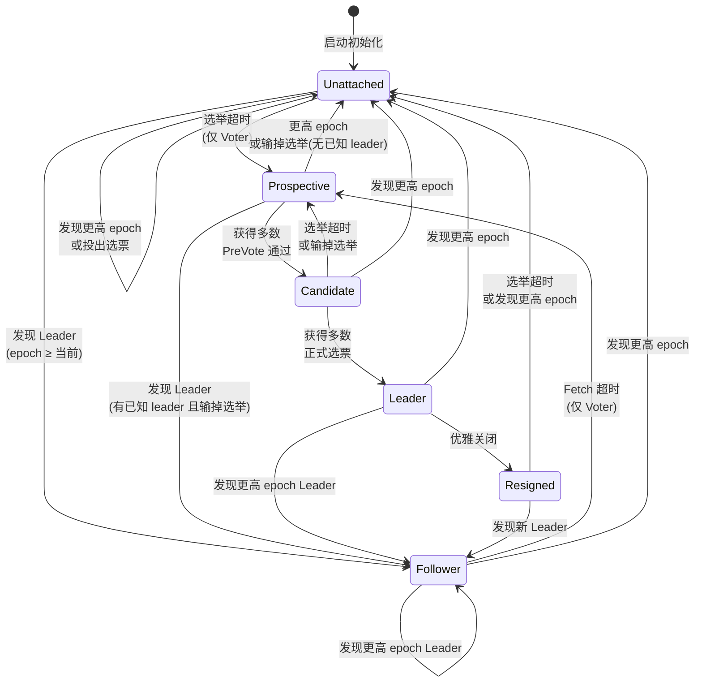
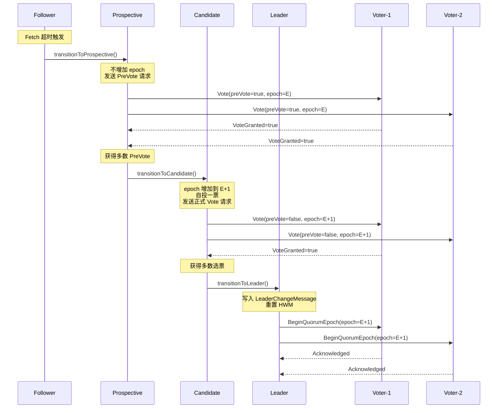
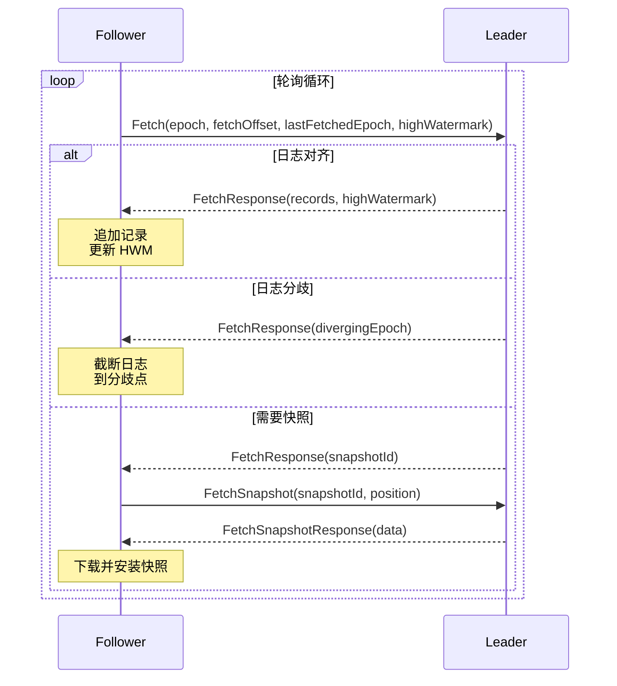
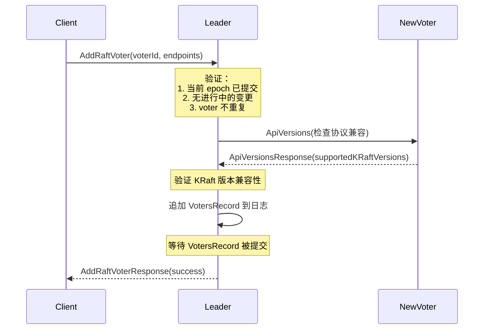

# Apache Kafka KRaft 协议底层运作机制深度源码解析

## 一、KRaft 协议总览

KRaft（Kafka Raft）是 Kafka 自研的 Raft 共识协议实现，用于替代 ZooKeeper 进行集群元数据管理。其核心源码位于 `raft/src/main/java/org/apache/kafka/raft/` 目录。

### 与标准 Raft 的关键差异

| 特性 | 标准 Raft | KRaft |
|------|-----------|-------|
| 日志复制方式 | Leader 主动推送 | **Follower 拉取（Fetch-driven）** |
| 领导者通知 | 通过 AppendEntries 空心跳 | **专用 BeginQuorumEpoch RPC** |
| 日志对齐方式 | 逐条回退 nextIndex | **Kafka 日志协调协议（diverging epoch）** |
| PreVote 支持 | 论文扩展 | **原生 Prospective 状态** |
| 选举退位 | 无标准机制 | **专用 EndQuorumEpoch RPC** |
| 节点角色 | Voter | **Voter + Observer** |
| 动态成员变更 | Joint Consensus / 单步变更 | **AddVoter / RemoveVoter RPC** |

### 核心源码文件

| 文件 | 行数 | 职责 |
|------|------|------|
| [KafkaRaftClient.java](file:///c:/Users/Administrator/kafka/raft/src/main/java/org/apache/kafka/raft/KafkaRaftClient.java) | 4147 | 协议主引擎：RPC 处理、状态转换驱动、事件轮询 |
| [QuorumState.java](file:///c:/Users/Administrator/kafka/raft/src/main/java/org/apache/kafka/raft/QuorumState.java) | 935 | 状态机管理：7 种状态及所有合法转换 |
| [LeaderState.java](file:///c:/Users/Administrator/kafka/raft/src/main/java/org/apache/kafka/raft/LeaderState.java) | 1154 | Leader 状态：HWM 推进、CheckQuorum、Batch 累积 |
| [FollowerState.java](file:///c:/Users/Administrator/kafka/raft/src/main/java/org/apache/kafka/raft/FollowerState.java) | ~300 | Follower 状态：Fetch 超时、快照拉取 |
| [CandidateState.java](file:///c:/Users/Administrator/kafka/raft/src/main/java/org/apache/kafka/raft/CandidateState.java) | ~200 | Candidate 状态：投票计数、选举超时 |
| [ProspectiveState.java](file:///c:/Users/Administrator/kafka/raft/src/main/java/org/apache/kafka/raft/ProspectiveState.java) | ~200 | Prospective 状态：PreVote 计数 |
| [UnattachedState.java](file:///c:/Users/Administrator/kafka/raft/src/main/java/org/apache/kafka/raft/UnattachedState.java) | ~200 | Unattached 状态：等待发现 Leader |
| [ResignedState.java](file:///c:/Users/Administrator/kafka/raft/src/main/java/org/apache/kafka/raft/ResignedState.java) | ~150 | Resigned 状态：优雅退位 |
| [ElectionState.java](file:///c:/Users/Administrator/kafka/raft/src/main/java/org/apache/kafka/raft/ElectionState.java) | 218 | 选举状态持久化（epoch、leaderId、votedKey） |

---

## 二、状态机详解

### 2.1 七种状态定义

KRaft 定义了 **7 种节点状态**，每种状态由对应的 `EpochState` 子类实现：



### 2.2 状态转换的持久化机制

状态转换分为两类（[QuorumState.java#L729-L743](file:///c:/Users/Administrator/kafka/raft/src/main/java/org/apache/kafka/raft/QuorumState.java#L729-L743)）：

```java
// 持久化转换：写入 quorum-state 文件后再更新内存
private void durableTransitionTo(EpochState newState) {
    store.writeElectionState(newState.election(), partitionState.lastKraftVersion());
    memoryTransitionTo(newState);
}

// 内存转换：仅更新内存状态（如 Prospective、Resigned 等软状态）
private void memoryTransitionTo(EpochState newState) {
    if (state != null) state.close();
    state = newState;
}
```

**持久化的内容**（`ElectionState`）：
- `epoch`：当前选举轮次
- `leaderId`：已知的 Leader ID（可选）
- `votedKey`：已投票给的候选人（ReplicaKey = nodeId + directoryId）
- 存储文件：`quorum-state`，由 `FileQuorumStateStore` 管理

---

## 三、选举流程详解

### 3.1 完整选举时序



### 3.2 第一步：Prospective 状态（PreVote 阶段）

**触发条件**（[KafkaRaftClient.java#L3504-L3506](file:///c:/Users/Administrator/kafka/raft/src/main/java/org/apache/kafka/raft/KafkaRaftClient.java#L3504-L3506)）：
- **Voter 在 Unattached 状态**：选举超时到期
- **Voter 在 Follower 状态**：Fetch 超时到期（Leader 无响应）

**转换逻辑**（[QuorumState.java#L605-L636](file:///c:/Users/Administrator/kafka/raft/src/main/java/org/apache/kafka/raft/QuorumState.java#L605-L636)）：
```java
public void transitionToProspective() {
    // 仅 Voter 可以，Observer 不能
    // 不增加 epoch，只是内存转换（不持久化）
    memoryTransitionTo(new ProspectiveState(
        time, localIdOrThrow(), epoch(),
        leaderId(),           // 保留已知的 Leader ID
        state.leaderEndpoints(),
        votedKey(),           // 保留已投的选票
        partitionState.lastVoterSet(),
        state.highWatermark(),
        randomElectionTimeoutMs(),
        logContext
    ));
}
```

**PreVote 请求构建**（[KafkaRaftClient.java#L2965-L2977](file:///c:/Users/Administrator/kafka/raft/src/main/java/org/apache/kafka/raft/KafkaRaftClient.java#L2965-L2977)）：
```java
private VoteRequestData buildVoteRequest(ReplicaKey remoteVoter, boolean preVote) {
    OffsetAndEpoch endOffset = endOffset();
    return RaftUtil.singletonVoteRequest(
        log.topicPartition(), clusterId,
        quorum.epoch(),              // 不增加 epoch
        quorum.localReplicaKeyOrThrow(),
        remoteVoter,
        endOffset.epoch(),           // 日志最后 epoch
        endOffset.offset(),          // 日志最后偏移量
        preVote                      // true = PreVote
    );
}
```

**PreVote 的目的**：防止网络分区中的节点在恢复后用高 epoch 干扰集群。PreVote 阶段不增加 epoch，不改变其他节点状态。

### 3.3 第二步：投票判定

接收方判定是否授票（[QuorumState.java#L886-L933](file:///c:/Users/Administrator/kafka/raft/src/main/java/org/apache/kafka/raft/QuorumState.java#L886-L933)）：

```java
public static boolean unattachedOrProspectiveCanGrantVote(
    OptionalInt leaderId, Optional<ReplicaKey> votedKey,
    int epoch, ReplicaKey replicaKey,
    boolean isLogUpToDate, boolean isPreVote, Logger log
) {
    if (isPreVote) {
        // PreVote：仅检查日志是否足够新
        return isLogUpToDate;
    } else if (votedKey.isPresent()) {
        // 正式投票：已投票则只能投给同一候选人
        return votedReplicaKey.id() == replicaKey.id();
    } else if (leaderId.isPresent()) {
        // 已知有 Leader：拒绝投票
        return false;
    } else {
        // 未投票且无 Leader：检查日志是否足够新
        return isLogUpToDate;
    }
}
```

**日志比较规则**（[KafkaRaftClient.java#L916-L920](file:///c:/Users/Administrator/kafka/raft/src/main/java/org/apache/kafka/raft/KafkaRaftClient.java#L916-L920)）：
```java
boolean voteGranted = quorum.canGrantVote(
    replicaKey,
    lastEpochEndOffsetAndEpoch.compareTo(endOffset()) >= 0,  // 候选人日志 ≥ 本地日志
    preVote
);
```
比较优先级：**先比较 epoch，再比较 offset**。确保选出的 Leader 拥有最完整的已提交日志。

### 3.4 第三步：Candidate 状态（正式投票阶段）

**触发条件**：Prospective 获得多数 PreVote。

**转换逻辑**（[QuorumState.java#L638-L654](file:///c:/Users/Administrator/kafka/raft/src/main/java/org/apache/kafka/raft/QuorumState.java#L638-L654)）：
```java
public void transitionToCandidate() {
    // 只允许从 Prospective 转换
    checkValidTransitionToCandidate();
    int newEpoch = epoch() + 1;  // 增加 epoch
    durableTransitionTo(new CandidateState(  // 持久化转换
        time, localIdOrThrow(), localDirectoryId, newEpoch,
        partitionState.lastVoterSet(),
        state.highWatermark(), randomElectionTimeoutMs(), logContext
    ));
}
```

**关键**：进入 Candidate 时，自动给自己投一票。发送正式 Vote 请求（`preVote=false`），接收方会持久化投票记录。

### 3.5 第四步：成为 Leader

**触发条件**：Candidate 获得多数正式选票（[KafkaRaftClient.java#L676-L683](file:///c:/Users/Administrator/kafka/raft/src/main/java/org/apache/kafka/raft/KafkaRaftClient.java#L676-L683)）。

**Leader 初始化**（[KafkaRaftClient.java#L642-L668](file:///c:/Users/Administrator/kafka/raft/src/main/java/org/apache/kafka/raft/KafkaRaftClient.java#L642-L668)）：
```java
private void onBecomeLeader(long currentTimeMs) {
    // 1. 创建 BatchAccumulator 用于累积写入
    BatchAccumulator<T> accumulator = new BatchAccumulator<>(
        quorum.epoch(), endOffset, ...);

    // 2. 状态转换
    LeaderState<T> state = quorum.transitionToLeader(endOffset, accumulator);

    // 3. 初始化日志 epoch
    log.initializeLeaderEpoch(quorum.epoch());

    // 4. 立即写入 LeaderChangeMessage 控制记录
    //    这是推进 HWM 的前提！
    state.appendStartOfEpochControlRecords(currentTimeMs);

    // 5. 重置所有连接
    resetConnections();
}
```

> [!IMPORTANT]
> Leader 在成为领导者后会**立即重置 High Watermark**（[QuorumState.java#L699-L708](file:///c:/Users/Administrator/kafka/raft/src/main/java/org/apache/kafka/raft/QuorumState.java#L699-L708)）。只有当多数 Voter 的 Fetch 偏移量超过新 epoch 的起始偏移量时，HWM 才会推进。这保证了全局 HWM 的单调递增性。

### 3.6 第五步：Leader 通知（BeginQuorumEpoch）

Leader 通过 `BeginQuorumEpoch` RPC 通知所有 Voter（[KafkaRaftClient.java#L3103-L3133](file:///c:/Users/Administrator/kafka/raft/src/main/java/org/apache/kafka/raft/KafkaRaftClient.java#L3103-L3133)）：

```java
private long maybeSendBeginQuorumEpochRequests(LeaderState<T> state, long currentTimeMs) {
    // 定期检查哪些 Voter 需要发送 BeginQuorumEpoch
    Set<ReplicaKey> needToSend = state.needToSendBeginQuorumRequests(currentTimeMs);
    // 对于 fetchTimeoutMs/2 时间内未 Fetch 的 Voter，发送 BeginQuorumEpoch
    maybeSendRequests(currentTimeMs, needToSend, ...);
}
```

接收方处理（[KafkaRaftClient.java#L1091-L1159](file:///c:/Users/Administrator/kafka/raft/src/main/java/org/apache/kafka/raft/KafkaRaftClient.java#L1091-L1159)）：
- 如果 epoch ≥ 当前 epoch → 转换为 Follower
- 如果 epoch < 当前 epoch → 返回 `FENCED_LEADER_EPOCH`

---

## 四、日志复制机制

### 4.1 Fetch-Driven 复制模型

KRaft 与标准 Raft 最大的区别：**不是 Leader 推数据，而是 Follower 拉数据**。



### 4.2 Follower 轮询逻辑

Follower 的核心轮询在 [KafkaRaftClient.java#L3313-L3348](file:///c:/Users/Administrator/kafka/raft/src/main/java/org/apache/kafka/raft/KafkaRaftClient.java#L3313-L3348)：

```java
private long pollFollowerAsVoter(FollowerState state, long currentTimeMs) {
    if (shutdown != null) {
        return 0;  // 正在关闭，立即退出
    } else if (state.hasFetchTimeoutExpired(currentTimeMs)) {
        // Fetch 超时 → 转为 Prospective（开始选举）
        transitionToProspective(currentTimeMs);
        return 0;
    } else if (state.hasUpdateVoterSetPeriodExpired(currentTimeMs)) {
        // 定期发送 UpdateVoter 请求（KRaft v1）
        if (shouldSendUpdateVoteRequest(state)) {
            maybeSendUpdateVoterRequest(state, currentTimeMs);
        } else {
            maybeSendFetchToBestNode(state, currentTimeMs);
        }
    } else {
        // 常规路径：发送 Fetch 请求给 Leader
        maybeSendFetchToBestNode(state, currentTimeMs);
    }
}
```

### 4.3 Fetch 请求构建

```java
private FetchRequestData buildFetchRequest() {
    return RaftUtil.singletonFetchRequest(
        log.topicPartition(), log.topicId(),
        fetchPartition -> fetchPartition
            .setCurrentLeaderEpoch(quorum.epoch())     // 当前认知的 epoch
            .setLastFetchedEpoch(log.lastFetchedEpoch()) // 日志最后条目的 epoch
            .setFetchOffset(log.endOffset().offset())     // 从此偏移量开始拉取
            .setReplicaDirectoryId(quorum.localDirectoryId())
            .setHighWatermark(quorum.highWatermark()...)  // 本地 HWM
    );
}
```

### 4.4 Leader 处理 Fetch 请求

[KafkaRaftClient.java#L1596-L1648](file:///c:/Users/Administrator/kafka/raft/src/main/java/org/apache/kafka/raft/KafkaRaftClient.java#L1596-L1648)：

```java
private FetchResponseData tryCompleteFetchRequest(...) {
    // 1. 验证：确保请求来自同 epoch 的 Follower
    validateLeaderOnlyRequest(request.currentLeaderEpoch());

    // 2. 验证 Fetch 偏移量的合法性
    ValidOffsetAndEpoch validOffsetAndEpoch;
    if (fetchOffset == 0 && latestSnapshotId.isPresent()) {
        validOffsetAndEpoch = ValidOffsetAndEpoch.snapshot(latestSnapshotId.get());
    } else {
        validOffsetAndEpoch = log.validateOffsetAndEpoch(fetchOffset, lastFetchedEpoch);
    }

    // 3. 读取并返回日志数据
    if (validOffsetAndEpoch.kind() == VALID) {
        LogFetchInfo info = log.read(fetchOffset, Isolation.UNCOMMITTED);
        // 更新该 Follower 的复制进度 → 可能推进 HWM
        if (state.updateReplicaState(replicaKey, currentTimeMs, info.startOffsetMetadata)) {
            onUpdateLeaderHighWatermark(state, currentTimeMs);
        }
        records = info.records;
    }
}
```

### 4.5 日志分歧处理（Log Reconciliation）

当 Follower 的日志与 Leader 不一致时（[KafkaRaftClient.java#L1736-L1758](file:///c:/Users/Administrator/kafka/raft/src/main/java/org/apache/kafka/raft/KafkaRaftClient.java#L1736-L1758)）：

```java
// Leader 返回 divergingEpoch
if (divergingEpoch.epoch() >= 0) {
    // 截断日志到分歧点
    long truncationOffset = log.truncateToEndOffset(divergingOffsetAndEpoch);
    // 更新 KRaft 控制记录状态机
    partitionState.truncateNewEntries(truncationOffset);
}
```

**分歧检测原理**：Leader 通过比较 Follower 报告的 `lastFetchedEpoch` 和 `fetchOffset` 与自身日志，找到第一个不匹配的 epoch 边界，返回该 epoch 的结束偏移量作为截断点。

### 4.6 快照传输

当 Follower 的日志起始偏移量落后于 Leader 的日志起始偏移量时（[KafkaRaftClient.java#L1759-L1801](file:///c:/Users/Administrator/kafka/raft/src/main/java/org/apache/kafka/raft/KafkaRaftClient.java#L1759-L1801)）：

```java
// Leader 返回 snapshotId → Follower 开始下载快照
state.setFetchingSnapshot(log.createNewSnapshotUnchecked(snapshotId));
// 后续 poll 循环中发送 FetchSnapshot 请求分片下载
```

快照下载完成后（[KafkaRaftClient.java#L2175-L2204](file:///c:/Users/Administrator/kafka/raft/src/main/java/org/apache/kafka/raft/KafkaRaftClient.java#L2175-L2204)）：
1. 冻结快照文件
2. 截断整个日志
3. 从快照重新加载状态
4. 更新 HWM

---

## 五、High Watermark 推进机制

### 5.1 Leader 端 HWM 推进

HWM 由 Leader 根据**多数 Voter 的复制进度**计算（[LeaderState.java#L727-L786](file:///c:/Users/Administrator/kafka/raft/src/main/java/org/apache/kafka/raft/LeaderState.java#L727-L786)）：

```java
private boolean maybeUpdateHighWatermark() {
    // 1. 按 Fetch 偏移量降序排列所有 Voter
    ArrayList<ReplicaState> sorted = followersByDescendingFetchOffset()
        .collect(Collectors.toCollection(ArrayList::new));

    // 2. 找到第 N/2 个位置的偏移量（中位数 = 多数确认的偏移量）
    int indexOfHw = voterStates.size() / 2;
    Optional<LogOffsetMetadata> hwUpdateOpt = sorted.get(indexOfHw).endOffset;

    // 3. 关键约束：HWM 必须超过当前 epoch 的起始偏移量
    //    这确保了 Leader 至少提交了一条自己 epoch 的记录
    if (highWatermarkUpdateOffset > epochStartOffset) {
        highWatermark = hwUpdateOpt;
        return true;
    }
}
```

> [!IMPORTANT]
> **Epoch 起始偏移量约束**是 KRaft 安全性的关键保证。Leader 必须先提交至少一条自己 epoch 的记录（`LeaderChangeMessage`），HWM 才能推进。这保证了未来的 Leader 一定会包含这条记录，从而保证已提交日志的不可丢失性。

### 5.2 Follower 端 HWM 更新

Follower 从 Fetch 响应中获取 Leader 的 HWM（[KafkaRaftClient.java#L342-L354](file:///c:/Users/Administrator/kafka/raft/src/main/java/org/apache/kafka/raft/KafkaRaftClient.java#L342-L354)）：

```java
private void updateFollowerHighWatermark(FollowerState state, OptionalLong highWatermarkOpt) {
    highWatermarkOpt.ifPresent(highWatermark -> {
        // 取 min(本地日志末尾, Leader的HWM) 防止超前
        long newHighWatermark = Math.min(endOffset().offset(), highWatermark);
        if (state.updateHighWatermark(OptionalLong.of(newHighWatermark))) {
            log.updateHighWatermark(new LogOffsetMetadata(newHighWatermark));
            updateListenersProgress(newHighWatermark);
        }
    });
}
```

---

## 六、Leader 活性检测

### 6.1 CheckQuorum 机制

Leader 通过 CheckQuorum 定时器检查自身是否仍被多数 Voter 承认（[LeaderState.java#L223-L268](file:///c:/Users/Administrator/kafka/raft/src/main/java/org/apache/kafka/raft/LeaderState.java#L223-L268)）：

```java
public long timeUntilCheckQuorumExpires(long currentTimeMs) {
    // 单节点集群永不过期
    if (voterStates.size() == 1) return Long.MAX_VALUE;
    
    // 超时 = fetchTimeoutMs × 1.5
    checkQuorumTimer.update(currentTimeMs);
    return checkQuorumTimer.remainingMs();
}

public void updateCheckQuorumForFollowingVoter(ReplicaKey replicaKey, long currentTimeMs) {
    fetchedVoters.add(replicaKey.id());
    int majority = (voterStates.size() / 2) + 1;
    // Leader 自身计入多数
    if (voterStates.containsKey(localVoterNode.voterKey().id())) {
        majority = majority - 1;
    }
    // 如果收到多数 Voter 的 Fetch → 重置定时器
    if (fetchedVoters.size() >= majority) {
        fetchedVoters.clear();
        checkQuorumTimer.reset(checkQuorumTimeoutMs);
    }
}
```

**如果 CheckQuorum 超时**（[KafkaRaftClient.java#L3170-L3174](file:///c:/Users/Administrator/kafka/raft/src/main/java/org/apache/kafka/raft/KafkaRaftClient.java#L3170-L3174)）：
```java
if (timeUntilCheckQuorumExpires == 0) {
    // Leader 主动退位
    transitionToResigned(state.nonLeaderVotersByDescendingFetchOffset());
}
```

### 6.2 优雅退位（EndQuorumEpoch）

Leader 退位时（[KafkaRaftClient.java#L3135-L3164](file:///c:/Users/Administrator/kafka/raft/src/main/java/org/apache/kafka/raft/KafkaRaftClient.java#L3135-L3164)）：

```java
private long pollResigned(long currentTimeMs) {
    // 向所有未确认的 Voter 发送 EndQuorumEpoch
    maybeSendRequests(currentTimeMs,
        voterNodes(state.unackedVoters()),
        () -> buildEndQuorumEpochRequest(state)  // 包含 preferredSuccessors
    );

    if (state.hasElectionTimeoutExpired(currentTimeMs)) {
        // 等待一个选举超时后，增加 epoch 防止自己的旧 Fetch 响应干扰
        transitionToUnattached(quorum.epoch() + 1, OptionalInt.empty());
    }
}
```

**优先继任者（Preferred Successors）**：退位的 Leader 按 Fetch 偏移量降序排列其他 Voter，作为 `preferredSuccessors` 告知所有 Voter。接收方使用指数退避机制让排名靠前的候选人先发起选举：

```java
private long endEpochElectionBackoff(Collection<ReplicaKey> preferredCandidates) {
    int position = /* 自己在 preferredCandidates 中的位置 */;
    return strictExponentialElectionBackoffMs(position, preferredCandidates.size());
    // position=0 → 立即选举
    // position=1 → 短延迟
    // position=N → 长延迟
}
```

---

## 七、事件驱动轮询主循环

### 7.1 pollCurrentState

整个 KRaft 协议由一个事件驱动的轮询循环驱动（[KafkaRaftClient.java#L3517-L3533](file:///c:/Users/Administrator/kafka/raft/src/main/java/org/apache/kafka/raft/KafkaRaftClient.java#L3517-L3533)）：

```java
private long pollCurrentState(long currentTimeMs) {
    if (quorum.isLeader())     return pollLeader(currentTimeMs);
    if (quorum.isCandidate())  return pollCandidate(currentTimeMs);
    if (quorum.isProspective()) return pollProspective(currentTimeMs);
    if (quorum.isFollower())   return pollFollower(currentTimeMs);
    if (quorum.isUnattached()) return pollUnattached(currentTimeMs);
    if (quorum.isResigned())   return pollResigned(currentTimeMs);
}
```

### 7.2 各状态轮询逻辑

| 状态 | 主要行为 | 超时处理 |
|------|----------|----------|
| **Leader** | 刷写 Batch、发送 BeginQuorumEpoch、CheckQuorum | CheckQuorum 超时 → Resigned |
| **Candidate** | 发送 Vote 请求、检查投票结果 | 选举超时 → Prospective |
| **Prospective** | 发送 PreVote 请求、检查预投票结果 | 选举超时 → Follower/Unattached |
| **Follower** | 发送 Fetch/FetchSnapshot、发送 UpdateVoter | Fetch 超时 → Prospective (Voter)<br/>Fetch 超时 → Unattached (Observer) |
| **Unattached** | 向 Bootstrap 发送 Fetch 发现 Leader | 选举超时 → Prospective (Voter) |
| **Resigned** | 发送 EndQuorumEpoch | 选举超时 → Unattached(epoch+1) |

### 7.3 请求/响应分发

所有入站消息由 [handleInboundMessage](file:///c:/Users/Administrator/kafka/raft/src/main/java/org/apache/kafka/raft/KafkaRaftClient.java#L2829-L2843) 分发：

```java
private void handleInboundMessage(RaftMessage message, long currentTimeMs) {
    if (message instanceof RaftRequest.Inbound request) {
        handleRequest(request, currentTimeMs);  // 处理入站请求
    } else if (message instanceof RaftResponse.Inbound response) {
        handleResponse(response, currentTimeMs);  // 处理入站响应
    }
}
```

请求路由到对应处理器（[KafkaRaftClient.java#L2802-L2827](file:///c:/Users/Administrator/kafka/raft/src/main/java/org/apache/kafka/raft/KafkaRaftClient.java#L2802-L2827)）：

| API Key | 处理方法 | 说明 |
|---------|----------|------|
| `VOTE` | `handleVoteRequest` | PreVote/正式投票 |
| `BEGIN_QUORUM_EPOCH` | `handleBeginQuorumEpochRequest` | Leader 宣布新 epoch |
| `END_QUORUM_EPOCH` | `handleEndQuorumEpochRequest` | Leader 优雅退位 |
| `FETCH` | `handleFetchRequest` | 日志复制 |
| `FETCH_SNAPSHOT` | `handleFetchSnapshotRequest` | 快照传输 |
| `DESCRIBE_QUORUM` | `handleDescribeQuorumRequest` | 查询仲裁状态 |
| `ADD_RAFT_VOTER` | `handleAddVoterRequest` | 动态添加 Voter |
| `REMOVE_RAFT_VOTER` | `handleRemoveVoterRequest` | 动态移除 Voter |
| `UPDATE_RAFT_VOTER` | `handleUpdateVoterRequest` | 更新 Voter 信息 |

---

## 八、动态成员变更（KRaft v1）

### 8.1 AddVoter 流程



### 8.2 RemoveVoter 流程

类似 AddVoter，但 Leader 会在 VotersRecord 提交后，如果移除的是自己，则主动退位。

### 8.3 KRaft 版本升级（v0 → v1）

KRaft v0 使用静态 Voter 配置，v1 支持动态重配置。升级流程：
1. 所有 Voter 向 Leader 发送 `UpdateRaftVoter` 请求，报告自己的 endpoints 和支持的 KRaft 版本
2. Leader 在内存中维护 `KRaftVersionUpgrade.Voters` 状态
3. 当所有 Voter 都报告了信息且都支持 v1，客户端触发升级
4. Leader 追加包含 `KRaftVersionRecord` + `VotersRecord` 的控制 Batch

---

## 九、安全性保证总结

| 安全性质 | 保证机制 |
|----------|----------|
| **选举安全性**（每个 epoch 最多一个 Leader） | 持久化 `votedKey` + 每个 epoch 最多投一票 |
| **Leader 完整性**（Leader 拥有所有已提交记录） | 投票时要求候选人日志 ≥ 投票者日志 |
| **日志匹配**（相同 epoch+offset 的记录相同） | Fetch-driven 日志对齐 + diverging epoch 截断 |
| **HWM 单调递增** | 新 Leader 重置 HWM，仅在提交自己 epoch 的记录后推进 |
| **防分区干扰** | PreVote 机制避免分区节点的 epoch 膨胀 |
| **Leader 活性** | CheckQuorum 定时器 + Fetch 超时促使重新选举 |
| **成员变更安全** | 一次只处理一个变更 + 等待 HWM 推进确认提交 |
