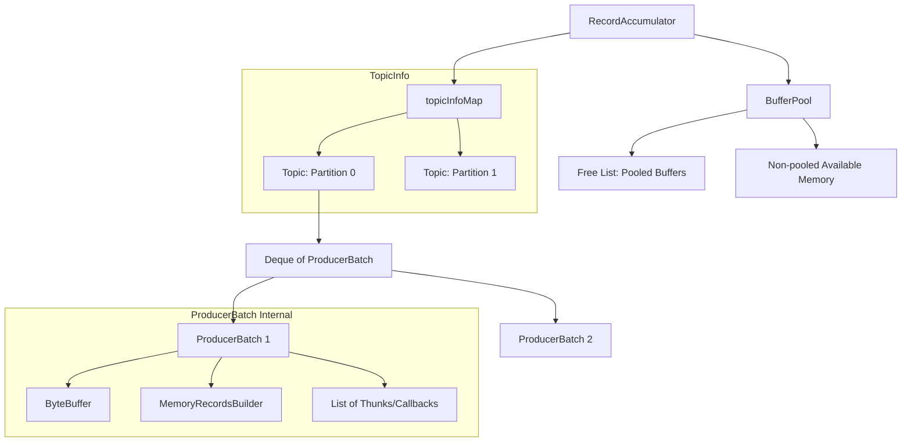

# Kafka Producer RecordAccumulator 内存模型深度解析

[RecordAccumulator](file:///c:/Users/Administrator/kafka_server/clients/src/main/java/org/apache/kafka/clients/producer/internals/RecordAccumulator.java#68-1306) 是 Kafka Java Client 中实现高性能写入的核心组件。它通过批量化消息（Batching）和高效的内存池管理（BufferPool），在降低 I/O 频率的同时，极大减少了由于频繁分配和回收 [ByteBuffer](file:///c:/Users/Administrator/kafka_server/clients/src/main/java/org/apache/kafka/clients/producer/internals/BufferPool.java#238-242) 带来的 GC 开销。

---

## 1. 核心架构图

以下是 [RecordAccumulator](file:///c:/Users/Administrator/kafka_server/clients/src/main/java/org/apache/kafka/clients/producer/internals/RecordAccumulator.java#68-1306) 的层级结构及内存组织方式：

---

## 2. BufferPool：内存池管理机制

[BufferPool](file:///c:/Users/Administrator/kafka_server/clients/src/main/java/org/apache/kafka/clients/producer/internals/BufferPool.java#45-357) 是 [RecordAccumulator](file:///c:/Users/Administrator/kafka_server/clients/src/main/java/org/apache/kafka/clients/producer/internals/RecordAccumulator.java#68-1306) 的基石，负责整个 Producer 的内存预算。

### 2.1 内存配额 (Total Memory)
由 `buffer.memory` 参数定义。它是 Producer 可用于排队消息的总内存硬限制。

### 2.2 两级内存管理
BufferPool 将内部分为两类维护：
1.  **池化内存 (Pooled Buffers)**：
    *   仅管理大小正好等于 `batch.size` 的 [ByteBuffer](file:///c:/Users/Administrator/kafka_server/clients/src/main/java/org/apache/kafka/clients/producer/internals/BufferPool.java#238-242)。
    *   存储在 [free](file:///c:/Users/Administrator/kafka_server/clients/src/main/java/org/apache/kafka/clients/producer/internals/BufferPool.java#243-251) 队列（`Deque<ByteBuffer>`）中。
    *   **复用逻辑**：当申请 `batch.size` 且池中有空闲块时，直接弹出复用，避免分配开销。
2.  **非池化内存 (Non-pooled Available Memory)**：
    *   用于申请大于 `batch.size` 的大批次（单条记录超过 `batch.size` 时）。
    *   由 `nonPooledAvailableMemory` 计数器跟踪。
    *   **复用逻辑**：这部分内存使用后直接销毁，不进入 [free](file:///c:/Users/Administrator/kafka_server/clients/src/main/java/org/apache/kafka/clients/producer/internals/BufferPool.java#243-251) 队列，但会把额度还给 `nonPooledAvailableMemory`。

### 2.3 分配策略与公平锁
当内存不足时，申请线程会进入 [waiters](file:///c:/Users/Administrator/kafka_server/clients/src/main/java/org/apache/kafka/clients/producer/internals/BufferPool.java#337-341) 队列并阻塞。
*   **公平性**：使用 `ReentrantLock` 的公平模式或显式的 [waiters](file:///c:/Users/Administrator/kafka_server/clients/src/main/java/org/apache/kafka/clients/producer/internals/BufferPool.java#337-341) 列表，确保先入先得。
*   **阻塞与超时**：取决于 `max.block.ms` 参数。超时后抛出 `BufferExhaustedException`。

---

## 3. ProducerBatch：内存的逻辑载体

[ProducerBatch](file:///c:/Users/Administrator/kafka_server/clients/src/main/java/org/apache/kafka/clients/producer/internals/ProducerBatch.java#60-613) 是消息累积的基本单位。

*   **独占 Buffer**：每个 Batch 从 [BufferPool](file:///c:/Users/Administrator/kafka_server/clients/src/main/java/org/apache/kafka/clients/producer/internals/BufferPool.java#45-357) 中获取一个 [ByteBuffer](file:///c:/Users/Administrator/kafka_server/clients/src/main/java/org/apache/kafka/clients/producer/internals/BufferPool.java#238-242)。
*   **MemoryRecordsBuilder**：负责在 Buffer 内按二进制协议写入 Record 及其 Header。
*   **压缩优化**：记录在写入 Buffer 前会被实时压缩（如开启 GZIP/LZ4）。
*   **状态转换**：
    *   **Appending**：允许写入新消息。
    *   **Closed For Appends**：当空间不足或超时准备发送时，关闭写入流，释放压缩缓冲区等中间开销，但保留 Buffer。
    *   **Drained**：被 Sender 线程取走，标记为 In-flight。

---

## 4. 内存生命周期流程

1.  **Allocate (分配)**：
    *   `Producer.send()` 调用 `RA.append()`。
    *   若当前 Partition 的最后那个 Batch 空间不足，向 [BufferPool](file:///c:/Users/Administrator/kafka_server/clients/src/main/java/org/apache/kafka/clients/producer/internals/BufferPool.java#45-357) 请求内存。
2.  **Fill (填充)**：
    *   消息序列化并写入 [ProducerBatch](file:///c:/Users/Administrator/kafka_server/clients/src/main/java/org/apache/kafka/clients/producer/internals/ProducerBatch.java#60-613) 的内存位。
3.  **Drain (导出)**：
    *   Sender 线程轮询，将满足发送条件的 Batches 从队列中 poll 出来。
4.  **Complete (完成)**：
    *   收到 Broker 的 ACK 后。
5.  **Deallocate (释放)**：
    *   调用 `RA.deallocate(batch)`。
    *   **关键点**：如果 Buffer 大小等于 [poolableSize](file:///c:/Users/Administrator/kafka_server/clients/src/main/java/org/apache/kafka/clients/producer/internals/BufferPool.java#323-329)，它会被 `buffer.clear()` 后放回 `BufferPool.free` 队列；否则，扣除的额度返还给 [availableMemory](file:///c:/Users/Administrator/kafka_server/clients/src/main/java/org/apache/kafka/clients/producer/internals/BufferPool.java#282-293)。

---

## 5. 特殊情况：Split Batch (分片批次)

当 Broker 因 `message.max.bytes` 限制拒绝了一个大 Batch 时，Client 会执行 [split](file:///c:/Users/Administrator/kafka_server/clients/src/main/java/org/apache/kafka/clients/producer/internals/ProducerBatch.java#326-332)：
*   **内存来源**：Split 产生的子 Batches 是通过 `ByteBuffer.allocate()` 在 JVM 堆上**临时分配**的，**不占用 [BufferPool](file:///c:/Users/Administrator/kafka_server/clients/src/main/java/org/apache/kafka/clients/producer/internals/BufferPool.java#45-357) 的限制额度**。
*   **风险**：如果发生大规模重试和分片，可能会导致 JVM 堆内存压力（OOM），因为它们躲过了 `buffer.memory` 的总量管控。

---

## 6. 核心参数对内存模型的影响

| 参数 | 影响 |
| :--- | :--- |
| `buffer.memory` | 总预算。过小会导致频繁阻塞，过大浪费 JVM 堆空间。 |
| `batch.size` | 决定了哪些 Buffer 可以被 Pool 化复用。如果大部分消息都很小，设置为适中值（如 16KB）最能体现内存复用优势。 |
| `linger.ms` | 间接影响内存。时间越长，Batch 内存驻留时间越久。 |
| `compression.type` | 压缩会增加写入时的 CPU 开销，但能提高单个 Batch 承载的消息密度。 |

---

> [!TIP]
> **调优建议**：如果你的 `max.request.size` 设置得很大，而 `batch.size` 依然是默认的 16KB，那么单条大消息将频繁导致非池化分配。建议将 `batch.size` 调整为更合理的业务均值。
